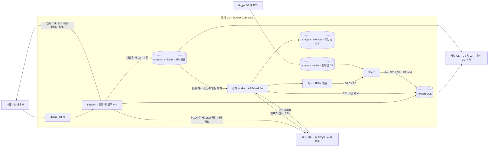
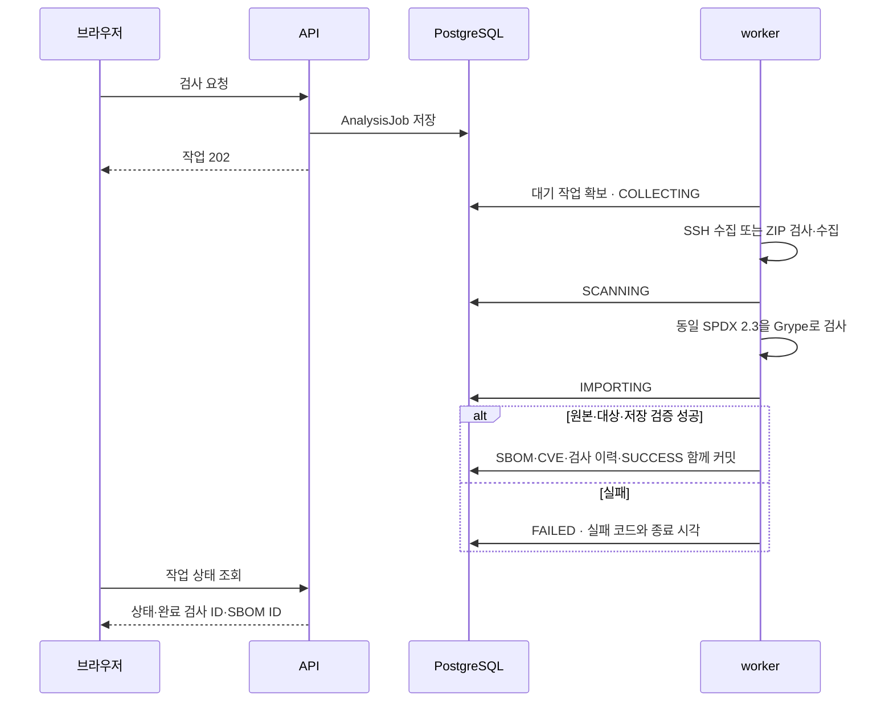

# EOLWatch 전체 구조

코드 기준: 2026-09-21 (재범위화 커밋 `73c10b5`). 이 문서는 구현 구조이며, 실행 결과·배포 버전은 [구현 현황](IMPLEMENTATION_STATUS.md)과 과거 [확장 검증 기록](PROJECT_EXPANSION_VERIFICATION.md)에 있다.

## 1. 구성과 데이터 흐름

관리 웹과 검사 대상은 별개다. 사용자 PC에는 브라우저가 필요하고, SSH 수집·ZIP 검사·SPDX 변환·Grype 실행은 관리 worker가 처리한다. SSH 점검(서버 정보 수집)은 API 프로세스가 동기로 실행한다.

## 2. 두 축의 입력과 범위 식별

| 축 | 프로필 | 실행 위치·방식 | 저장되는 `scan_scope` |
|---|---|---|---|
| 개발 검사 | `source-zip` | 관리 worker의 작업별 해제 경로, 기본 패키지 cataloger | `source-zip:<프로젝트 이름>` |
| 인프라 검사 | `ubuntu-dpkg-installed` | 대상 서버, `dpkg-db-cataloger` | 프로필명 |

다른 경로·프로젝트의 검사를 같은 범위로 합치지 않는다. 전후 비교는 여기에 서버와 시간 순서까지 확인한다. 일반 폴더/ZIP은 빌드·설치를 하지 않으며 `.git`과 중첩 압축 내부 탐색을 제외한다. 대상 SSH 서버는 worker와 같은 CPU 아키텍처의 Linux arm64 또는 amd64가 필요하다. ZIP은 대상 서버에 SSH로 접속하지 않는다.

ZIP 기본 한도는 업로드 500 MiB, 해제 합계 2 GiB, 파일당 256 MiB, 200,000항목, 압축률 100배다. 상대 경로 이탈·중복 경로·심볼릭 링크·특수 파일·암호화 ZIP을 거부한다. SHA-256 이름의 원본을 저장하고 실행·재시도 시 해시와 크기를 다시 확인한다. 이 처리를 임의 프로그램 실행을 위한 완전한 샌드박스라고 부르지 않는다.

## 3. 인프라 검사의 서버 정보 수집

`services/collector.py`가 SSH로 다음을 읽어 `check_results`에 저장한다. 모든 명령은 읽기 전용이며 도구나 파일이 없어도 수집이 실패하지 않는다.

| 항목 | 명령 | 저장 위치 |
|---|---|---|
| CPU·메모리·디스크 사용률, 가동 시간, 프로세스 | `top`, `/proc/meminfo`, `df -P`, `/proc/uptime`, `ps -eo` | `check_results` 컬럼·`disk_details`·`process_details` |
| 설치 패키지, OS 배포판, 아키텍처 | `dpkg-query -W` 또는 `rpm -qa`, `/etc/os-release`, `uname -m` | `raw_metrics.packages`, `raw_metrics.package_context` |
| 호스트·커널·CPU 모델·코어 수·메모리 총량·디스크 총량 | `hostname`, `uname -r`, `/proc/cpuinfo`, `nproc`, `/proc/meminfo`, `df -P -B1` | `raw_metrics.server_info` |
| 가상화·클라우드 | `systemd-detect-virt`, `/sys/class/dmi/id/sys_vendor`·`product_name`, EC2 IMDSv2 인스턴스 문서(2초 타임아웃) | `raw_metrics.server_info.platform`, `.cloud` |
| 통신 정보·실행 서비스 | `ip -4 addr`, `ss -tln`, `systemctl list-units --state=running` | `raw_metrics.server_info.ip_addresses`, `.listening_ports`, `.services` |

플랫폼은 `aws`/`gcp`/`azure`/`physical`/가상화 종류(`kvm`, `vmware` 등)/`unknown`으로 판정한다. 클라우드 계정 API는 연동하지 않으며 서버 안에서 읽을 수 있는 메타데이터·DMI로 한정한다. 이 정보는 화면 설명용이며 취약점 판정에 쓰지 않는다. 화면에서는 서버 목록의 `서버 정보` 열(OS·코어·메모리·실행 환경)과 수집 이력의 `서버 정보` 카드(호스트·OS·하드웨어·실행 환경·통신 정보·실행 서비스)로 보여준다.

## 4. DB 큐

- 같은 서버의 활성 검사는 하나다. 같은 범위·같은 업로드 해시 요청은 기존 작업을 반환하고 충돌하는 범위/업로드는 409다.
- 기본 큐 확인 주기는 3초이며 한 worker의 검사 실행은 동시에 하나다. 작업 확보·`worker_token`·생존 확인으로 중복 실행과 오래된 worker의 뒤늦은 저장을 막는다.
- 실행 중 약 5초마다 생존 시각을 갱신한다. 기본 180초 이상 끊긴 작업은 실패로 전환하며 재시도는 새 작업 이력을 만든다.
- 취소는 대기 작업이면 즉시, 실행 중이면 프로세스 종료 확인 후 확정한다. [취소 운영](ANALYSIS_CANCELLATION.md)을 따른다.
- SSH 점검(`CollectionJob`)은 API가 동기로 실행하는 별도 흐름이며 APScheduler가 일일 자동 점검도 예약한다.

## 5. 데이터와 업무 관계

| 데이터 | 목적 |
|---|---|
| Asset | 등록 서버의 식별·SSH 접속 정보 |
| CollectionJob·CheckResult | SSH 점검 이력과 자원 사용률·설치 패키지·서버 정보 |
| AnalysisUpload | 서버·프로젝트명·파일명·크기·원본 SHA-256 |
| AnalysisJob | 요청 범위·입력 스냅샷·진행·실패·재시도·취소 |
| SbomDocument·Component·DependencyEdge | 원본과 검색용 구성요소·라이선스·해시·의존관계 |
| ProductRelease | 구성요소 식별용 내부 테이블 (제품 버전 묶음) |
| AnalysisRun | 특정 시점의 SPDX·Grype 원본, 도구/DB 정보·해시·탐지 건수 |
| Vulnerability·ComponentVulnerability | CVE와 설치 구성요소 연결, 출처별 심각도·수정 버전·현재 검토 상태 |
| VulnerabilityAction | 메모·작성자·전후 상태의 추가형 이력 |
| User·AuditLog | 관리자/조회자 계정과 변경 감사 로그 |

CVE 작업목록은 전체 SBOM 이력을 대상으로 서버에서 개수·정렬·페이지를 계산한다. 단건 조치와 구성요소 목록 탐색도 큰 원본을 필요할 때만 읽는다. 개요 화면은 서버·범위별 마지막 성공 메타데이터를 사용하며, 과거 미완료 조치를 최신 탐지 수로 표현하지 않는다.

## 6. CVE 정확성과 조치 근거

Grype는 실제 생성한 SPDX를 입력으로 사용하며 원본 보고서와 매칭 출처를 저장한다. OS 패키지는 pkg:deb PURL로 배포판 수정 버전 기준으로 매칭하고, 서버의 패키지 관리자가 실제로 제공하는 업데이트와 대조한다.

수정 버전은 같은 패키지·현재 버전이 포함된 구간에서 찾는다. 같은 CVE의 다른 advisory가 여전히 취약하다고 하는 후보는 제외한다. CVSS 2/3/4는 검증된 라이브러리로 계산하며 유효한 정보가 없으면 UNKNOWN이다. 미지원 생태계 순서·Git 그래프는 수정 버전 추정을 보류한다.

검사 비교는 수동 VEX 값을 과거 탐지 결과로 사용하지 않는다. 다중 버전·CVE 별칭·원본 해시와 서버·범위를 확인한다. 도구/DB 변경·수동 반입·식별 정보 부족에는 경고를 표시한다. 조치 저장은 현재 `review_revision`을 확인하고 상태·이력·감사를 원자적으로 저장한다. 미검출만으로 자동 FIXED하지 않는다.

## 7. 저장소·백업·운영 경계

| 볼륨 | 내용 |
|---|---|
| `postgres_data` | 업무·검사 원본·조치 이력 DB |
| `analysis_uploads` | DB에서 참조하는 원본 ZIP, API/worker 공유 |
| `analysis_artifacts` | 작업별 수집·검사 파일·실행 manifest |
| `analysis_cache` | 재사용하는 Grype DB |

`backup-runtime.py`는 DB에서 내보낸 동일 스냅샷으로 dump와 전체 테이블 해시를 만들고 그 스냅샷이 참조하는 ZIP을 함께 보관한다. `--verify-restore`는 새 임시 DB에 복원해 전체 행 수·내용 해시와 ZIP 해시를 대조한 뒤 임시 DB를 삭제한다. 완성된 백업만 보존 개수 정책에 포함하며, `--install-schedule`로 해당 프로젝트의 일일 03:20 cron을 등록할 수 있다.

이 백업의 범위는 DB와 참조된 ZIP이다. `.env`, SSH 키, 작업 디렉터리 전체, Grype 캐시, 서버 이미지와 운영 DB 자동 전환은 포함하지 않는다.

ADMIN은 서버 등록·검사·조치 변경을 수행하고 VIEWER는 조회·비교·다운로드·이력을 확인한다. 키·known_hosts는 서버에 읽기 전용으로 마운트하며 입력으로 임의 명령이나 개인키를 받지 않는다. 공개 다중 조직 SaaS, 컨테이너 이미지 입력, 자동 패치, 클라우드 계정 API 연동은 현재 범위 밖이다.

[API 안내](API.md) · [웹 사용 안내](WEB_ANALYSIS.md) · [교수님용 설명](PROFESSOR_PROJECT_GUIDE.md) · [과거 AWS 기록](AWS_DEPLOYMENT_RECORD.md)
