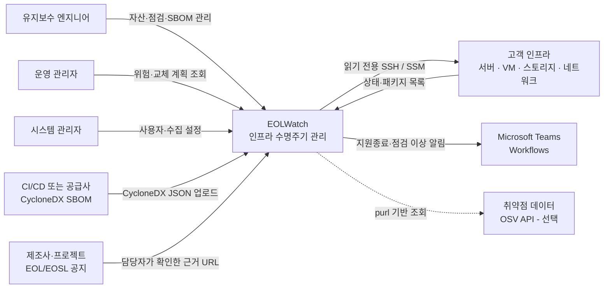
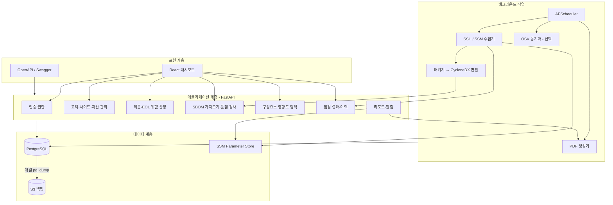
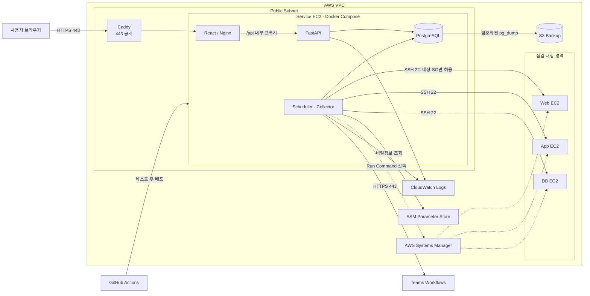
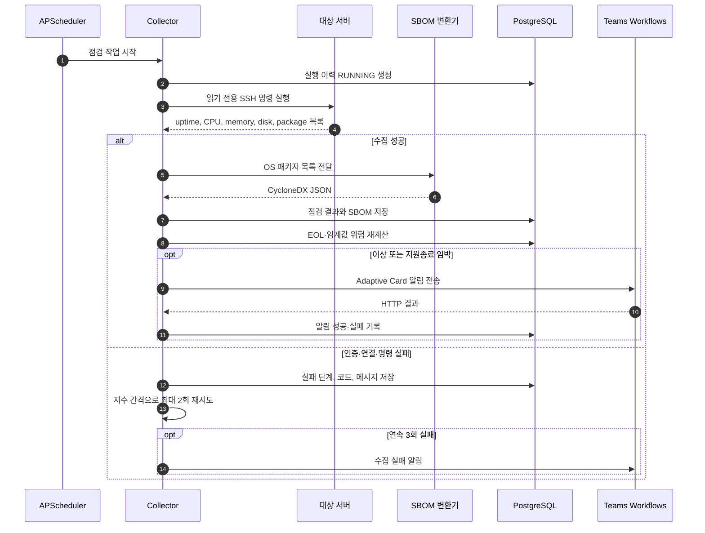
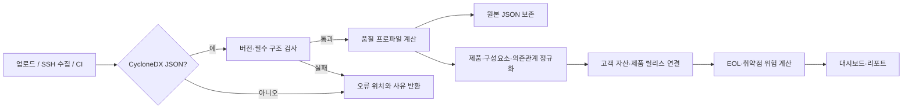

# EOLWatch 시스템 아키텍처

## 1. 설계 목표

EOLWatch는 여러 고객사의 인프라 자산을 유지관리하는 엔지니어가 장비와 인프라 소프트웨어의 지원종료 위험, SBOM 구성, 일일 점검 결과를 한곳에서 확인하는 시스템이다.

설계 우선순위는 다음 순서로 둔다.

1. **추적 가능성**: 위험 항목에서 고객·사이트·자산·소프트웨어까지 역추적할 수 있어야 한다.
2. **근거 보존**: 모든 EOL/EOSL 날짜는 공급사 원문 URL과 확인일을 함께 저장한다.
3. **대상 시스템 영향 최소화**: 별도 에이전트 설치 없이 읽기 전용 SSH 명령을 기본으로 한다.
4. **운영 가능성**: 자동 재기동, 수집 실패 기록, 백업과 복구 절차를 포함한다.
5. **1인 프로젝트 완주 가능성**: Kubernetes, Kafka, 별도 Redis/Celery를 사용하지 않는다.

## 2. 시스템 컨텍스트



제조사 EOL/EOSL 날짜는 자동 크롤링 결과를 그대로 확정하지 않는다. 공급사마다 용어와 지원 범위가 다르기 때문에 담당자가 공식 자료를 확인하고 URL과 확인일을 기록하는 반자동 방식으로 시작한다.

## 3. 논리 아키텍처



### 모듈 책임

| 모듈 | 책임 |
|---|---|
| 인증·권한 | 관리자와 조회자 로그인, API 접근 제어 |
| 자산 관리 | 고객·사이트·자산·계약과 물리 배치 정보 관리 |
| 제품 수명주기 | 하드웨어 모델과 인프라 소프트웨어 릴리스의 EOL/EOSL 근거 관리 |
| SBOM | CycloneDX 검증, 원본 보존, 구성요소와 의존관계 정규화 |
| 영향도 탐색 | purl/CPE → SBOM → 설치 자산 순서의 역추적 |
| 운영 점검 | 수집 실행, 성공·실패 사유, CPU·메모리·디스크 결과 저장 |
| 리포트·알림 | 위험 요약 PDF 생성, Teams Workflows 전송과 성공 여부 기록 |

## 4. 배포 및 네트워크 아키텍처



### 포트와 접근 규칙

| 구간 | 포트 | 규칙 |
|---|---:|---|
| 인터넷 → Caddy | 443 | 전체 공개, HTTPS만 허용 |
| 인터넷 → Caddy | 80 | 인증서 발급과 HTTPS 전환 용도 |
| 인터넷 → FastAPI/PostgreSQL | 없음 | 외부 공개 금지 |
| 서비스 EC2 → 대상 서버 | 22 | 대상 보안그룹에서 서비스 보안그룹만 허용 |
| 서비스 → Teams/OSV/AWS API | 443 | 필요한 외부 API만 송신 |
| 관리자 → 서비스 EC2 | SSM | 운영 서버의 공개 SSH 포트 제거 |

현재 코드의 `docker-compose.yml`은 로컬 개발용이라 8000·8080 포트를 공개한다. AWS 배포본에서는 Caddy만 80·443을 공개하고 API·DB는 Compose 내부 네트워크에서만 접근하게 분리한다.

## 5. 일일 수집 흐름



수집 실패를 정상 상태와 구분한다. `정상`, `임계값 초과`, `접속 실패`, `인증 실패`, `명령 실패`, `파싱 실패`를 별도 코드로 저장해야 “점검하지 못한 서버”가 정상으로 보이지 않는다.

## 6. SBOM 처리 흐름



SBOM 원본은 재처리와 감사를 위해 그대로 저장하고, 검색에 필요한 데이터는 관계형 테이블로 분리한다. 문서의 `bom-ref`는 문서 안의 관계 식별자이고, 서로 다른 문서 사이에서 같은 패키지를 찾을 때는 purl, CPE, 공급사·이름·버전 조합 순서로 매칭한다.

## 7. 가용성·백업·보안

- 모든 컨테이너에 상태 확인과 `unless-stopped` 재기동 정책을 둔다.
- PostgreSQL은 매일 `pg_dump` 후 S3에 업로드하고 7일 보관 정책을 적용한다.
- 6주차에 새 DB 컨테이너로 복구해 자산-SBOM-의존관계가 유지되는지 확인한다.
- SSH 개인키, DB 비밀번호, Teams URL은 코드와 DB에 평문 저장하지 않고 Parameter Store에서 주입한다.
- 대상 서버 점검 계정은 `uptime`, `free`, `df`, `ps`, `dpkg-query` 또는 `rpm` 등 조회 명령만 허용한다.
- SBOM 업로드는 JSON 크기 제한과 중첩 깊이 제한을 적용한다.
- 로그인, 자산 변경, EOL 근거 변경, SBOM 삭제는 감사 로그로 남긴다.
- AWS 안의 EC2는 가능하면 SSH 대신 Systems Manager Run Command를 사용한다.

## 8. 구현 단계와 아키텍처 차이

| 영역 | 현재 MVP | 목표 아키텍처 |
|---|---|---|
| 자산 | 고객·사이트·제품·계약·CSV 등록 구현 | 실제 고객 데이터 정제 |
| SBOM | 공식 스키마 검증·정규화·영향 탐색·버전 비교 구현 | 대규모 문서 성능 검증 |
| 수집 | SSH 수집·이력·일일 worker 구현 | 실제 EC2 3대 실증, AWS SSM 추가 |
| 취약점 | purl 기반 OSV 조회와 VEX 상태 구현 | 주기 스캔과 재시도 |
| 인증 | 관리자·조회자 RBAC와 감사 로그 구현 | 로그인 실패 제한과 비밀번호 변경 |
| 알림 | Teams Workflows 수동 요약과 전송 이력 구현 | 실제 Workflow URL 검증 |
| 보고서 | 지원종료·점검 PDF 구현 | 회사 양식과 결재란 반영 |
| 배포 | AWS 리소스 20개 실제 생성 | 서비스 배치·HTTPS·백업 복구 실증 |
| 백업 | pg_dump·S3 스크립트 구현 | 실제 S3 백업과 복구 실증 |

이 표의 목표 아키텍처를 최종 발표 기준으로 삼고, 각 기능을 구현할 때 ERD와 API 명세를 함께 갱신한다.

## 9. 목표 저장소 구조

```text
eolwatch/
├── backend/
│   ├── app/
│   │   ├── api/             # HTTP 라우터
│   │   ├── domain/          # 자산·수명주기·SBOM 규칙
│   │   ├── collectors/      # SSH·SSM 수집기
│   │   ├── jobs/            # 스케줄 작업
│   │   ├── integrations/    # Teams·OSV·S3
│   │   ├── models/          # SQLAlchemy 모델
│   │   └── schemas/         # Pydantic 입출력 스키마
│   ├── alembic/             # DB 마이그레이션
│   └── tests/
├── frontend/
│   └── src/
│       ├── features/        # 자산·SBOM·점검 화면
│       ├── components/      # 공통 UI
│       └── api/             # API 호출 모듈
├── infrastructure/
│   ├── terraform/           # VPC·EC2·S3·보안그룹
│   └── caddy/               # HTTPS 프록시 설정
├── scripts/                 # 백업·복구·운영 명령
├── docs/                    # 설계·API·운영 문서
├── samples/                 # 시연용 자산·SBOM 데이터
└── docker-compose.yml
```

현재 파일을 한 번에 모두 이동하지 않고 기능을 추가할 때 도메인 단위로 분리한다. 빈 구조만 먼저 만드는 것은 피하고 실제 코드가 생기는 시점에 디렉터리를 만든다.
