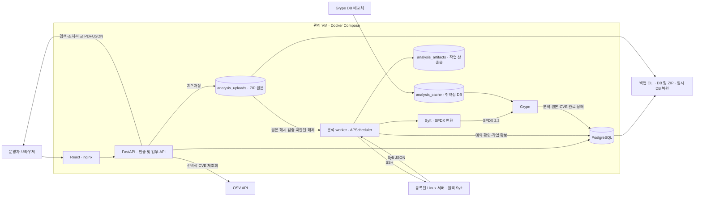
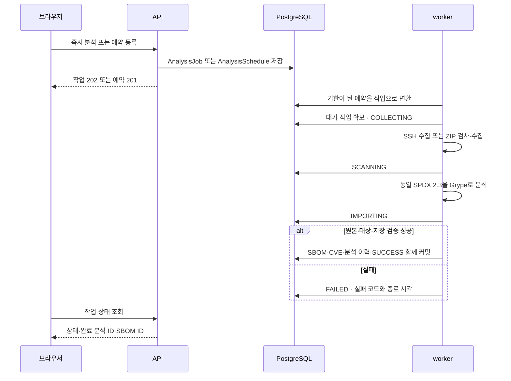

# EOLWatch 전체 구조

코드 기준: 2026-09-15 기능 확장. 이 문서는 구현 구조이며, 실행 결과·배포 버전은 [확장 검증 기록](PROJECT_EXPANSION_VERIFICATION.md)에 기록한다.

## 1. 구성과 데이터 흐름

관리 웹과 분석 대상 앱은 별개다. 운영자 PC에는 브라우저가 필요하고, SSH 수집·ZIP 분석·SPDX 변환·Grype 실행은 관리 worker가 처리한다. Black Duck 서버·계정은 필수가 아니다.

## 2. 분석 입력과 범위 식별

| 프로필 | 실행 위치·방식 | 저장되는 `scan_scope` |
|---|---|---|
| `ubuntu-dpkg-installed` | 대상 서버, `dpkg-db-cataloger` | 프로필명 |
| `demo-python-venv` | 대상의 고정 가상환경, `python-installed-package-cataloger` | 프로필명 |
| `ssh-python-environment` | 지정한 절대 경로의 설치 Python 메타데이터 | `ssh-python-environment:<경로>` |
| `ssh-project-directory` | 지정한 프로젝트 경로, 기본 패키지 cataloger | `ssh-project-directory:<경로>` |
| `source-zip` | 관리 worker의 작업별 해제 경로, 기본 패키지 cataloger | `source-zip:<프로젝트 이름>` |

다른 경로·프로젝트의 분석을 같은 범위로 합치지 않는다. 전후 비교는 여기에 자산과 시간 순서까지 확인한다. 일반 폴더/ZIP은 빌드·설치를 하지 않으며 `.git`과 중첩 압축 내부 탐색을 제외한다. 대상 SSH 서버는 worker와 같은 CPU 아키텍처의 Linux arm64 또는 amd64가 필요하다. ZIP은 대상 서버에 SSH로 접속하지 않는다.

ZIP 기본 한도는 업로드 50 MiB, 해제 합계 250 MiB, 파일당 32 MiB, 20,000항목, 압축률 100배다. 상대 경로 이탈·중복 경로·심볼릭 링크·특수 파일·암호화 ZIP을 거부한다. SHA-256 이름의 원본을 저장하고 실행·재시도 시 해시와 크기를 다시 확인한다. 이 처리를 임의 프로그램 실행을 위한 완전한 샌드박스라고 부르지 않는다.

## 3. DB 큐와 예약

- 같은 자산의 활성 분석은 하나다. 같은 범위·같은 업로드 해시 요청은 기존 작업을 반환하고 충돌하는 범위/업로드는 409다.
- 기본 큐 확인 주기는 3초이며 한 worker의 분석 실행은 동시에 하나다. 작업 확보·`worker_token`·생존 확인으로 중복 실행과 오래된 worker의 뒤늦은 저장을 막는다.
- 실행 중 약 5초마다 생존 시각을 갱신한다. 기본 180초 이상 끊긴 작업은 실패로 전환하며 재시도는 새 작업 이력을 만든다.
- 예약은 DB에 남고 5~525600분 주기로 설정한다. 중지·재개·주기 변경을 지원하며 같은 자산·범위의 중복 예약은 거부한다.
- 밀린 예약 횟수를 모두 재생하지 않고 다음 예정 시각을 계산한다. 예약 확보와 큐 저장을 같은 트랜잭션으로 처리한다. 다른 범위가 실행 중이면 예약을 유지해 후속 확인에서 다시 시도한다.
- 기존 일일 CPU·메모리·디스크 점검은 `CollectionJob` 기반의 별도 흐름이다.

## 4. 데이터와 업무 관계

| 데이터 | 목적 |
|---|---|
| Customer·Site·Asset | 고객·사이트·서버 자산과 접속·운영 정보 |
| ProductRelease·Deployment·Contract | 제품 버전의 지원 일정, 배포 자산, 유지보수 계약 |
| AnalysisUpload | 자산·프로젝트명·파일명·크기·원본 SHA-256 |
| AnalysisSchedule·AnalysisJob | 예약과 요청 범위·입력 스냅샷·진행·실패·재시도 |
| SbomDocument·Component·DependencyEdge | 원본과 검색용 구성요소·라이선스·해시·의존관계 |
| AnalysisRun | 특정 시점의 SPDX·Grype 원본, 도구/DB 정보·해시·탐지 건수 |
| Vulnerability·ComponentVulnerability | CVE와 설치 구성요소 연결, 출처별 심각도·수정 버전·현재 검토 상태 |
| VulnerabilityAction | 담당자·기한·메모·작성자·전후 상태·재분석 근거의 추가형 이력 |

구성요소에 개별 지원 종료일이 있으면 이를 사용한다. 없으면 연결된 제품의 보안지원 종료일 → 지원 종료일 → EOL 순으로 상속한다. 개별 날짜를 지우면 제품 일정으로 돌아간다. 제품 수정은 연결된 구성요소/자산의 위험 표시와 영향 조회에 반영된다.

CVE 작업목록은 전체 SBOM 이력을 대상으로 서버에서 개수·정렬·페이지를 계산한다. 단건 조치와 SBOM 탐색도 큰 원본을 필요할 때만 읽는다. 최신 분석 대시보드는 범위별 마지막 성공 메타데이터를 사용하며, 과거 미완료 조치를 최신 탐지 수로 표현하지 않는다.

## 5. CVE 정확성과 조치 근거

Grype는 실제 생성한 SPDX를 입력으로 사용하며 원본 보고서와 매칭 출처를 저장한다. OSV 재조회는 기존 Grype 연결·분석 ID·담당자 검토를 덮어쓰지 않는다. OSV는 PURL을 파싱하고 설치 버전을 확인한 뒤 모든 페이지와 advisory 상세를 읽는다. 일부 응답 누락은 정상 0건으로 저장하지 않는다.

수정 버전은 같은 패키지·현재 버전이 포함된 구간에서 찾는다. 같은 CVE의 다른 advisory가 여전히 취약하다고 하는 후보는 제외한다. CVSS 2/3/4는 검증된 라이브러리로 계산하며 유효한 정보가 없으면 UNKNOWN이다. 미지원 생태계 순서·Git 그래프는 수정 버전 추정을 보류한다.

분석 비교는 수동 VEX 값을 과거 탐지 결과로 사용하지 않는다. 다중 버전·CVE 별칭·원본 해시와 자산·범위를 확인한다. 도구/DB 변경·수동 반입·식별 정보 부족에는 경고를 표시한다. 조치 저장은 현재 `review_revision`을 확인하고 상태·이력·감사를 원자적으로 저장한다. 미검출만으로 자동 FIXED하지 않는다.

## 6. 저장소·백업·운영 경계

| 볼륨 | 내용 |
|---|---|
| `postgres_data` | 업무·분석 원본·조치 이력 DB |
| `analysis_uploads` | DB에서 참조하는 원본 ZIP, API/worker 공유 |
| `analysis_artifacts` | 작업별 수집·분석 파일·실행 manifest |
| `analysis_cache` | 재사용하는 Grype DB |

`backup-runtime.py`는 DB에서 내보낸 동일 스냅샷으로 dump와 전체 테이블 해시를 만들고 그 스냅샷이 참조하는 ZIP을 함께 보관한다. `--verify-restore`는 새 임시 DB에 복원해 전체 행 수·내용 해시와 ZIP 해시를 대조한 뒤 임시 DB를 삭제한다. 완성된 백업만 보존 개수 정책에 포함하며, `--install-schedule`로 해당 프로젝트의 일일 03:20 cron을 등록할 수 있다. 시간대는 실행 서버의 로컬 시간대다.

이 백업의 범위는 DB와 참조된 ZIP이다. `.env`, SSH 키, 작업 디렉터리 전체, Grype 캐시, 서버 이미지와 운영 DB 자동 전환은 포함하지 않는다. 실습 서버에 예약 설치·복원 검증을 실제로 수행했는지는 [확장 검증 기록](PROJECT_EXPANSION_VERIFICATION.md)에서 확인한다.

ADMIN은 분석·등록·조치 변경을 수행하고 VIEWER는 조회·비교·다운로드·이력을 확인한다. 키·known_hosts는 서버에 읽기 전용으로 마운트하며 입력으로 임의 명령이나 개인키를 받지 않는다. 공개 다중 조직 SaaS, 컨테이너 이미지 입력, Git URL 복제, 자동 패치는 현재 범위 밖이다.

[API 안내](API.md) · [웹 사용 안내](WEB_ANALYSIS.md) · [교수님용 설명](PROFESSOR_PROJECT_GUIDE.md) · [과거 AWS 기록](AWS_DEPLOYMENT_RECORD.md)
