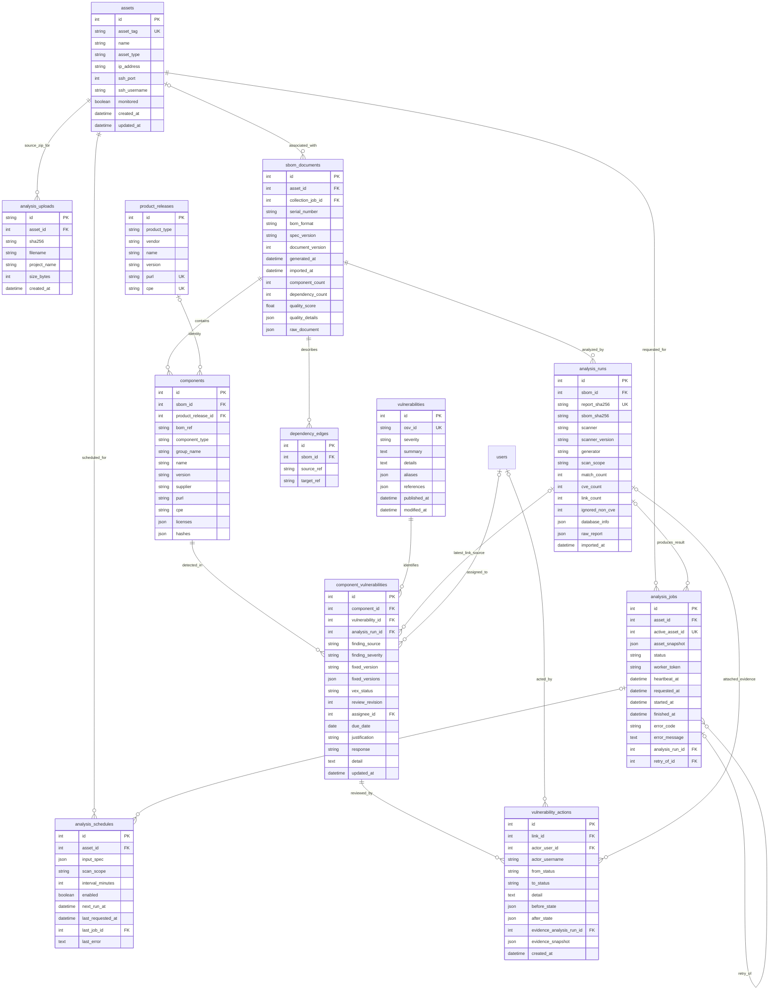
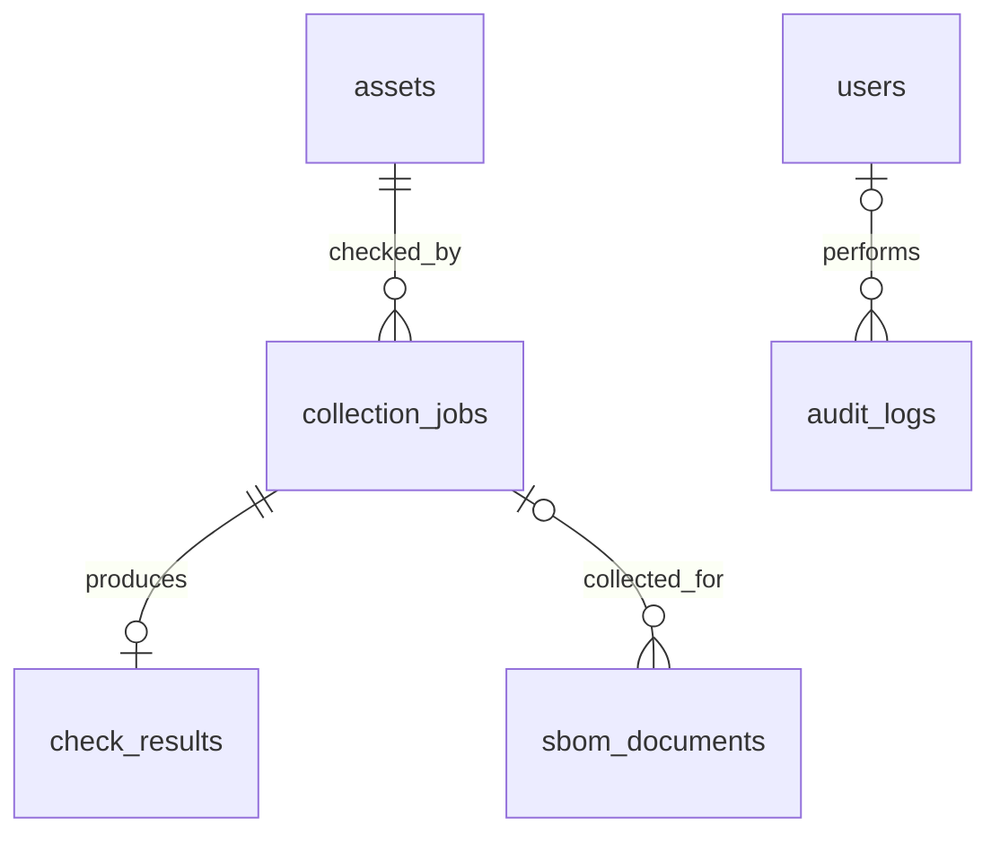

# EOLWatch 데이터 모델

기준일: 2026-09-21. [실제 모델](../backend/app/models.py)과 Alembic **`d2f8c4a71e9b`** 기준이다. 도면은 구현된 테이블·주요 컬럼을 발췌했으며 미래 설계 컬럼을 섞지 않는다. 현재 애플리케이션 테이블은 16개다. 2026-09-18 재범위화에서 고객·사이트·계약·배포·위험도 이력·EOL 카탈로그·알림 테이블과 자산 재고 컬럼, 제품·구성요소의 지원 종료일 컬럼을 제거했다.

## 1. 서버·검사·취약점 핵심 ERD



- `assets`는 등록 서버다. 식별 정보와 SSH 접속 정보만 보관하며 제조사·위치·구매·전력·담당자·운영 상태 컬럼은 없다. `asset_type`은 `server`, `storage`, `network`, `security`, `vm`, `cloud`, `other`다.
- `product_releases`는 구성요소 식별용 내부 테이블이다. `(product_type, vendor, name, version)`과 각각의 `purl`·`cpe`로 같은 패키지 버전을 하나로 묶는다. 지원 종료일·근거 URL 컬럼은 제거했다.
- `analysis_jobs.asset_snapshot`에 서버 ID·이름·번호·IP·SSH 포트·계정·`scan_scope`·입력 정보를 저장한다. 개인키와 로그인 토큰은 저장하지 않는다.
- `active_asset_id`는 **nullable 고유 컬럼이며 FK는 아니다.** 대기·실행 중에만 서버 ID를 넣어 같은 서버의 동시 검사를 막는다. 완료·실패·취소 시 NULL로 비운다.
- `worker_token`은 실행 작업의 소유권 확인 값이다. API 응답이나 보고서에는 노출하지 않는다.
- `analysis_uploads.id`는 UUID 문자열이며 원본 ZIP 파일은 `<sha256>.zip` 이름으로 업로드 볼륨에 있다.
- `analysis_schedules`는 `(asset_id, scan_scope)`당 한 건이다. ZIP 예약은 없다.
- `dependency_edges`는 SBOM 내부의 `source_ref`·`target_ref` 문자열을 저장한다. 구성요소 ID FK 두 개를 가진 구조가 아니다.
- `vulnerabilities.osv_id`는 기존 이름을 유지한다. Grype 반입 경로에서는 `CVE-...`를 저장하고 CVE가 아닌 별칭은 `aliases`로 보존한다.

## 2. 원본과 조회용 연결의 역할

| 데이터 | 용도 |
|---|---|
| `sbom_documents.raw_document` | 해당 시점의 SPDX 또는 CycloneDX 원본 |
| `analysis_runs.raw_report` | 해당 검사의 Grype 원본 |
| `components`, `component_vulnerabilities` | 구성요소·CVE 조회, 수동 VEX·조치 정보 |
| `analysis_runs.sbom_sha256` | 정규화한 SBOM JSON의 SHA-256 |
| `analysis_runs.report_sha256` | 이름과 달리 `asset_id + sbom + report` 묶음의 SHA-256. 동일 반입 식별에도 사용 |
| 비교·보고서 | 별도 결과 테이블 없이 원본에서 읽기 전용으로 계산 |
| `vulnerability_actions` | 조치 시점의 작성자·전후 상태·담당자/기한·선택한 재검사 근거 스냅샷 |

전후 비교는 변경 가능한 VEX 연결 값을 과거 탐지 근거로 사용하지 않는다. 같은 서버·범위·순서를 확인하고 원본 보고서의 CVE와 SBOM 설치 목록을 대조한다. 보고서 생성 시에는 원본 내용과 저장된 해시도 검증한다. 해시는 내용 일치 검사이며 외부 작성자의 서명은 아니다.

비교의 한 행은 **버전을 제외한 구성요소 식별자 + CVE**다. 생태계·네임스페이스·배포판·아키텍처·하위 경로와 동시에 설치된 버전 집합을 보존한다. `before_versions`·`after_versions`는 해당 식별자의 설치 목록이며, `NO_LONGER_DETECTED`를 자동 `FIXED`로 저장하지 않는다.

현재 조치 상태는 `component_vulnerabilities`에 있고 변경 이력은 `vulnerability_actions`에 추가한다. 클라이언트의 `expected_revision`과 현재 `review_revision`이 같을 때만 갱신한다. 상태 갱신·이력·`VULNERABILITY_ACTION` 감사 로그는 같은 트랜잭션이다. `actor_username`, `before_state`, `after_state`, `evidence_snapshot`은 기록 당시 값을 보존한다.

작성자·근거 검사 FK는 삭제 시 NULL이 될 수 있으나 스냅샷은 남는다. 해당 CVE 연결 자체를 삭제하면 `link_id`의 CASCADE가 적용되므로 이 테이블을 변경 불가능한 외부 감사 저장소로 설명하지 않는다.

## 3. 인프라 점검·인증 ERD



| 테이블 | 주요 실제 컬럼·역할 |
|---|---|
| `collection_jobs` | `asset_id`, `trigger_type`, `status`, `failure_stage`/`failure_code`/`failure_message`, `started_at`/`finished_at`, `retry_count` |
| `check_results` | `collection_job_id`, `cpu_percent`, `memory_percent`, `max_disk_percent`, `uptime_seconds`, `health_level`, `disk_details`, `process_details`, `raw_metrics` |
| `users` | `username`, `password_hash`, `role`(`ADMIN`/`VIEWER`), `active`, `created_at`, `last_login_at` |
| `audit_logs` | `user_id`, `username`, `action`, `method`, `path`, `status_code`, `ip_address`, `created_at` |

`check_results.raw_metrics`에는 `package_count`, `packages`, `package_context`(OS 배포판·아키텍처)와 `server_info`가 들어간다. `server_info`는 호스트명·커널·OS·CPU 모델·코어 수·메모리 총량·디스크 총량/사용량·가상화(`systemd-detect-virt`)·DMI 제조사/제품·플랫폼 판정(`aws`/`gcp`/`azure`/`physical`/가상화 종류)·EC2 인스턴스 메타데이터·IPv4 주소·수신 포트·실행 서비스 목록이다. 마이그레이션 없이 JSON 컬럼에 추가했으며 취약점 판정에는 쓰지 않는다.

일반 감사 로그는 로그인과 성공한 변경 요청의 사용자·경로·결과를 남긴다. 조치 변경의 전후 스냅샷은 `vulnerability_actions`에 따로 보존하며 일반 감사 로그가 모든 데이터의 변경 전후 복사본을 담는 것은 아니다.

## 4. 무결성과 상태

| 제약 | 실제 기준 |
|---|---|
| 서버·계정 식별 | `asset_tag`, `username` 각각 유일 |
| 제품 릴리스 | `(product_type, vendor, name, version)` 및 각각의 purl·CPE 고유 제약/인덱스 |
| SBOM | `(serial_number, document_version)` 유일 |
| 구성요소 | `(sbom_id, bom_ref)` 유일 |
| 의존관계 | `(sbom_id, source_ref, target_ref)` 유일 |
| CVE 연결 | `(component_id, vulnerability_id)` 유일 |
| 검사 원본 | `analysis_runs.report_sha256` 유일 |
| 점검 결과 | 한 `collection_job_id`당 최대 한 행 |
| 검사 요청 | 활성 작업에 한해 서버별 한 행. 재시도는 새 ID와 이전 작업 FK 사용 |
| 정기 검사 | `(asset_id, scan_scope)` 유일 |

SBOM의 서버 FK는 nullable이다. 일반 반입은 서버 없는 문서도 저장할 수 있지만 검사 묶음 반입·웹 검사·조치 비교는 서버를 요구한다. 입력 규칙은 API 스키마·서비스에서 검사하며 모두 DB CHECK 제약인 것은 아니다.

검사 작업 상태는 `QUEUED → COLLECTING → SCANNING → IMPORTING → SUCCESS`, 실패 시 `FAILED`, 취소 시 `CANCEL_REQUESTED → CANCELLED`다. VEX 상태는 `AFFECTED`, `NOT_AFFECTED`, `FIXED`, `UNDER_INVESTIGATION`이다.

주요 FK·식별·상태·검색 컬럼에 인덱스가 있다. JSON 원본은 SQLAlchemy `JSON` 컬럼으로 정의돼 있으며 JSONB 전용 설계가 아니다.

## 5. 마이그레이션과 보존

```text
3f012f421ca0  자산·제품·SBOM·점검 기본 구조
  → 91c6d6d4a2f1  인증·취약점·운영 기록
  → 7c61b9af20d4  수정 버전 정보
  → c4d62a8170b3  검사 원본·도구 정보와 CVE 연결 근거
  → d8a671ec54f2  웹 검사 작업·소유권·재시도
  → e5a294dc13b7  담당자·기한·조치 버전과 변경/근거 스냅샷
  → f8b319ac6402  ZIP 입력 보관과 정기 검사 예약
  → a16c902bf743  (과거) 공개 EOL 카탈로그 캐시·적용 이력
  → b7f2a9d1e8c4  (과거) 자산 재고 필드
  → c1e4f7a9b2d6  (과거) 자산 위험도 이력
  → d2f8c4a71e9b  EOL·재고·고객·계약·배포·알림 제거 (head)
```

`d2f8c4a71e9b`는 `lifecycle_catalog_applications`, `lifecycle_catalog_cache`, `asset_risk_snapshots`, `deployments`, `contract_assets`, `contracts`, `notification_deliveries`, `sites`, `customers` 테이블을 삭제한다. `assets`에서 `site_id`, `model_release_id`와 재고 컬럼 21개, `product_releases`에서 EOL·지원·보안지원 종료일과 근거 URL·확인 시각, `components`에서 `support_end_date`·`lifecycle_source_url`, `sbom_documents`에서 `software_product_id`를 제거한다. 다운그레이드는 컬럼·테이블 구조만 되돌리며 삭제한 데이터는 복구하지 않는다.

API 컨테이너 시작 시 `alembic upgrade head`를 적용한다. 비교·PDF·JSON 보고서는 기존 원본을 조회하므로 새 결과 테이블을 추가하지 않았다. 운영 DB의 downgrade·초기화는 평상시 갱신 절차가 아니다.

원본과 과거 이력을 보관하지만 자동 보존 기간·논리 삭제·외부 변경 방지 저장소가 모두 구현된 것은 아니다. 서버 삭제 API는 실제 삭제이며 DB의 `CASCADE`·`SET NULL` 관계가 적용될 수 있다. 시연 이력을 보존할 때는 서버·볼륨을 삭제하지 않고 DB와 필요한 원본을 백업한다.

실제 예시는 서버 #1 → 작업 #2/#3 → 검사 #3/#4 → SBOM #12/#13이다. [조치 검증](archive/REMEDIATION_VERIFICATION_2026-09-15.md)과 [보고서 검증](archive/COMPARISON_REPORT_VERIFICATION_2026-09-15.md)에 원본·화면 근거가 있다(당시 기록).
