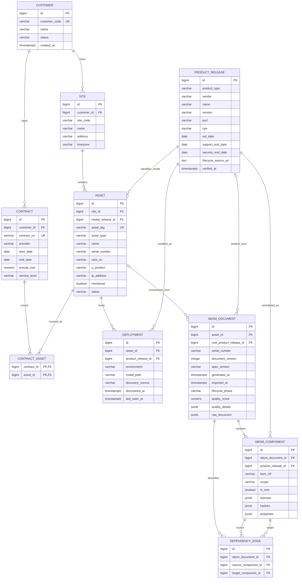
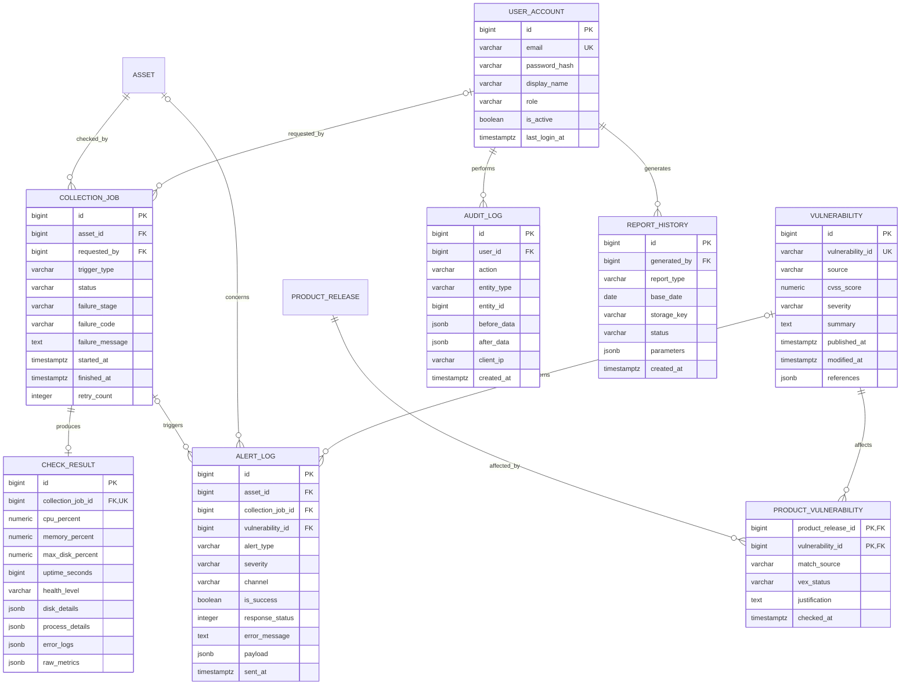

# EOLWatch 전체 ERD 및 데이터 설계

## 1. 설계 원칙

- 장비 모델과 소프트웨어 버전을 `PRODUCT_RELEASE`로 통합해 EOL/EOSL 계산을 한 방식으로 처리한다.
- 실제 설치된 장비는 `ASSET`, 자산 위에 설치된 소프트웨어는 `DEPLOYMENT`로 구분한다.
- SBOM 원본 문서와 검색용 구성요소를 모두 보존한다.
- 여러 고객사를 관리할 수 있도록 `CUSTOMER → SITE → ASSET` 구조를 사용한다.
- 반복 실행되는 점검 결과, 알림, 감사 기록은 마스터 데이터와 분리한다.

## 2. 핵심 자산·SBOM ERD



### 관계 해석 예시

```text
고객 A
└─ 본사 전산실
   └─ DB-SRV-001 (Dell PowerEdge R740)
      ├─ 유지보수 계약 2026-001
      ├─ Ubuntu Server 22.04 배포
      ├─ PostgreSQL 16.4 배포
      └─ 운영환경 SBOM v3
         ├─ Ubuntu Server 22.04
         ├─ PostgreSQL 16.4
         └─ OpenSSL 3.0.x
```

`PRODUCT_RELEASE`에는 실제 장비가 아니라 “Dell PowerEdge R740 모델”이나 “Ubuntu Server 22.04 릴리스”처럼 수명주기를 공유하는 대상을 저장한다. 같은 모델 장비 20대의 지원종료일을 수정할 때 한 행만 바꾸면 모든 자산에 반영된다.

## 3. 운영·취약점·감사 ERD



`ALERT_LOG`의 자산·점검·취약점 FK는 알림 종류에 따라 선택적으로 사용한다. 적어도 하나의 원인 정보가 존재하도록 애플리케이션에서 검증한다. `AUDIT_LOG.entity_id`는 여러 테이블을 가리키는 감사용 논리 참조이므로 실제 FK는 두지 않는다.

## 4. 주요 코드값

| 컬럼 | 허용 값 |
|---|---|
| `product_type` | HARDWARE_MODEL, OS, FIRMWARE, HYPERVISOR, MIDDLEWARE, DBMS, AGENT, LIBRARY, APPLICATION |
| `asset_type` | SERVER, STORAGE, NETWORK, SECURITY, VM, CLOUD, OTHER |
| `risk_level` | EXPIRED, CRITICAL, WARN, SAFE, UNKNOWN |
| `collection_job.status` | PENDING, RUNNING, SUCCESS, PARTIAL, FAILED |
| `failure_stage` | CONNECT, AUTH, COMMAND, PARSE, STORE, NONE |
| `trigger_type` | SCHEDULED, MANUAL, API |
| `user_account.role` | ADMIN, VIEWER |
| `vex_status` | NOT_AFFECTED, AFFECTED, FIXED, UNDER_INVESTIGATION, UNKNOWN |

위험도는 날짜에서 매번 계산하므로 기본적으로 테이블에 중복 저장하지 않는다. 대시보드 성능이 문제가 될 때만 Materialized View 또는 일일 스냅샷을 추가한다.

## 5. 무결성 규칙

1. `ASSET.asset_tag`는 전체 시스템에서 유일하다.
2. `PRODUCT_RELEASE`는 `(product_type, vendor, name, version)` 조합을 유일하게 관리한다.
3. EOL·EOSL·보안지원 종료일 중 하나를 입력하면 `lifecycle_source_url`과 `verified_at`이 필수다.
4. `DEPLOYMENT`의 `(asset_id, product_release_id, environment)` 조합은 중복될 수 없다.
5. `SBOM_DOCUMENT`는 `asset_id` 또는 `root_product_release_id` 중 하나 이상을 가져야 한다.
6. `SBOM_DOCUMENT`의 `(serial_number, document_version)`은 유일하다.
7. `SBOM_COMPONENT`의 `(sbom_document_id, bom_ref)`는 유일하다.
8. 의존관계의 시작과 끝 구성요소는 같은 SBOM 문서에 포함되어야 한다.
9. 점검 작업 하나에는 최종 점검 결과가 최대 하나만 존재한다.
10. 지원종료 근거를 바꾸면 변경 전후 값이 감사 로그에 남아야 한다.

## 6. 인덱스 계획

| 테이블 | 인덱스 | 사용 목적 |
|---|---|---|
| ASSET | `asset_tag`, `(site_id, status)`, `ip_address` | 자산 검색과 사이트별 현황 |
| PRODUCT_RELEASE | `purl`, `cpe`, `(vendor, name, version)`, `support_end_date` | 구성요소 매칭과 EOL 검색 |
| DEPLOYMENT | `asset_id`, `product_release_id` | 자산↔제품 양방향 영향도 탐색 |
| SBOM_DOCUMENT | `(serial_number, document_version)`, `asset_id`, `generated_at` | SBOM 버전과 자산 이력 |
| SBOM_COMPONENT | `product_release_id`, `(sbom_document_id, bom_ref)` | 동일 구성요소 사용 자산 검색 |
| COLLECTION_JOB | `(asset_id, started_at DESC)`, `(status, started_at)` | 최근 점검과 실패 작업 검색 |
| VULNERABILITY | `vulnerability_id`, `severity` | CVE/OSV 검색 |
| ALERT_LOG | `(is_success, sent_at)`, `asset_id` | 실패 알림 재처리와 이력 |
| AUDIT_LOG | `(entity_type, entity_id, created_at)` | 변경 추적 |

## 7. 데이터 보존

| 데이터 | 보존 기준 |
|---|---|
| 자산·제품·계약 | 논리 삭제 후 프로젝트 기간 동안 보존 |
| SBOM 원본과 구성요소 | 문서 버전별 보존, 임의 덮어쓰기 금지 |
| 상세 점검 결과 | 90일 |
| 일별 점검 요약 | 1년 |
| 알림 이력 | 1년 |
| 감사 로그 | 1년 이상 |
| DB 백업 | 일 1회, 최근 7일 |

## 8. 현재 코드와 목표 ERD의 대응

현재 MVP는 핵심 흐름을 먼저 검증하기 위해 단순화되어 있다.

| 현재 테이블 | 목표 구조 |
|---|---|
| `assets` | CUSTOMER·SITE·PRODUCT_RELEASE 연결 컬럼 추가 |
| `software_products` | `PRODUCT_RELEASE`로 통합 |
| `deployments` | 목표 구조 유지, 설치 위치와 last_seen 추가 |
| `sbom_documents` | 목표 구조 유지, 제품 릴리스 FK와 단계 정보 보강 |
| `components` | `SBOM_COMPONENT`와 `PRODUCT_RELEASE`로 분리 |
| `dependency_edges` | 문자열 ref 대신 구성요소 FK 사용 |

다음 DB 작업은 Alembic을 먼저 도입한 뒤 `CUSTOMER`, `SITE`, `PRODUCT_RELEASE` 순서로 마이그레이션한다. 운영·취약점 테이블은 수집기와 취약점 연동 기능을 만들 때 추가한다.
