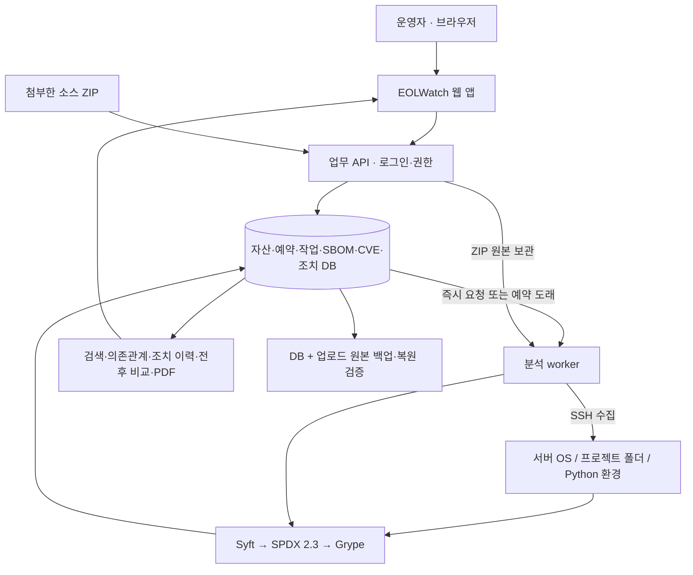

# 교수님 설명용: 전체 구조·웹 앱·시연 시나리오

기준: 현재 구현 코드. 실제 분석·화면·백업 증거는 [기능 확장 검증 기록](PROJECT_EXPANSION_VERIFICATION.md), 앞서 완료한 앱 업데이트 검증은 [조치 전후 검증](archive/REMEDIATION_VERIFICATION_2026-09-15.md)을 사용한다. 아래 시연 순서는 기능을 보여주는 계획이며 실행하지 않은 결과를 성공 기록으로 대신하지 않는다.

## 1. 무엇을 만드는가

**“EOLWatch는 서버와 프로젝트의 구성요소를 분석하고, CVE·지원 종료를 담당자의 조치 업무와 연결하는 웹 서비스입니다.”**

분석 도구인 Syft·Grype를 사용해 SBOM과 취약점 근거를 만들고, EOLWatch가 자산 연결·검색·작업 이력·예약·조치·전후 비교·보고서를 제공한다. Black Duck과 같은 구성요소·취약점 관리 분야이지만, 이번 프로젝트에서 Black Duck 제품 자체를 필수로 사용하지는 않는다.

## 2. 전체 구조는 어떻게 되는가

- 관리 VM 1대에서 웹·API·DB·worker를 실행한다.
- 대상 VM 2대는 실제 수집·분석할 서버다.
- 웹 요청은 먼저 DB 작업으로 저장되므로 사용자가 긴 분석 동안 HTTP 응답을 기다릴 필요가 없다.
- 서버 분석은 SSH로, 소스 ZIP은 관리 worker에서 처리한다. 둘 다 프로그램을 임의 실행하거나 패키지를 설치하지 않는다.
- 이전 분석 원본과 담당자 기록을 보존해 “무엇을 보고 조치했는지”를 다시 확인할 수 있다.

세부 구조·저장소는 [ARCHITECTURE.md](ARCHITECTURE.md)에 있다.

## 3. 어떤 애플리케이션인가

운영자가 사용하는 애플리케이션은 **EOLWatch 웹**이고, 취약 라이브러리를 포함한 Python 데모 앱이나 업로드 프로젝트는 **분석 대상**이다.

| 웹 화면 | 운영자가 하는 일 | 보여줄 핵심 |
|---|---|---|
| 운영 개요 | 자산별 최신 분석과 미완료 조치 확인 | 마지막 성공과 최근 실패·진행을 분리 |
| 고객·사이트 / 작업 대상 | 서버 등록·수정, 고객·사이트 연결 | CVE가 어느 자산의 문제인지 식별 |
| 프로젝트 분석 | ZIP 업로드, 서버 폴더/가상환경 지정, 정기 예약 | 고정 데모 외 실제 프로젝트 입력 |
| SBOM 원장 | 구성요소·버전·라이선스·의존관계·원본 탐색 | 분석 결과의 구성 근거 |
| 제품·계약 | 제품 일정·공식 근거·영향 자산·유지보수 연결 | 지원 종료와 운영 책임 연결 |
| CVE 조치 | 탐지 결과·수정 버전·전후 분석 비교 | 같은 자산·범위의 변화를 확인 |
| 조치 작업목록 | 담당자·기한·미지정·상태별 업무 처리 | 탐지 후 누가 무엇을 처리하는가 |
| 운영·보고서 | 권한·감사·PDF, 선택적 알림 설정 | 검토 자료와 변경 추적 |

## 3-1. 추가 시나리오: 재고자산 한 건을 기준으로 전체 위험 확인

**상황:** 담당자가 서버 자산의 위치·비용·운영 상태와 그 위의 소프트웨어 위험을 한 화면에서 확인하고, 먼저 처리할 자산을 결정한다.

| 순서 | 보여줄 화면/행동 | 설명할 내용 |
|---|---|---|
| 1 | `작업 대상 자산`에서 자산 등록 | 자산명·자산번호·모델명·시리얼번호·건물·층·랙 위치를 입력한다. |
| 2 | 구매·전력·담당자 정보 입력 | 구매가격·전력 사용량·전력 데이터 출처·담당 부서를 자산 원장에 기록한다. |
| 3 | 자산 검색·필터 | 자산명·모델·시리얼·IP·위치로 찾고 운영 상태·서비스 중요도로 좁힌다. |
| 4 | 처리 우선순위 확인 | CVE·지원 종료·서비스 중요도·운영 상태를 반영한 내부 위험 점수와 CVE 개수를 확인한다. |
| 5 | 자산 상세 탭 확인 | 기본 정보, 설치 소프트웨어, SBOM, 타임라인을 한 자산 기준으로 탐색한다. |
| 6 | QR·자산 PDF 사용 | QR로 현장 조회 주소를 만들고, 재고·SBOM·계약·분석 이력을 종합 PDF로 내려받는다. |
| 7 | 위험도 이력 저장 | 현재 점수와 산정 요소를 스냅샷으로 저장해 이후 점수 변화와 비교한다. |

종합 위험도는 **EOLWatch 내부 처리 우선순위 점수**다. CVSS나 실제 공격 가능성, 자동 조치 완료를 의미하지 않는다. 전력비는 입력한 전력량과 기본 단가를 사용한 추정치이며, 실제 전력 계측값과 구분해 설명한다.

## 4. 주 시나리오: 취약 라이브러리 업데이트 후 검증

**상황:** 운영 서버에 설치된 라이브러리에서 CVE가 검출됐다. 담당자가 버전을 올리고 서비스가 정상인지 확인한 뒤 분석 근거와 함께 조치를 기록한다.

| 순서 | 보여줄 화면/행동 | 설명할 내용 |
|---|---|---|
| 1 | 작업 대상의 LAB-VM-01 | 실제 서버 자산과 분석 범위 |
| 2 | 업데이트 전 분석 또는 그 저장된 원본 | Jinja2 3.1.4와 해당 CVE·수정 버전 |
| 3 | SBOM 상세 탐색 | 구성요소의 PURL·버전·라이선스·관계·원본 |
| 4 | 조치 작업목록 → 조치 관리 | 담당자·기한·검토 메모를 기록 |
| 5 | 대상 앱 라이브러리 업데이트와 HTTP 확인 | 운영자가 실제 변경과 정상 동작 확인을 수행 |
| 6 | 같은 서버·같은 범위 재분석 | 새 작업·분석 번호와 Jinja2 3.1.6 |
| 7 | 전후 비교 | 버전 변화, 재분석 미검출, 계속 검출·신규 여부 |
| 8 | 조치 관리에서 이후 분석을 근거로 첨부 | 실제 작업 메모와 운영자의 완료 판단·변경 이력 |
| 9 | PDF·JSON 다운로드 | 원본 해시·범위·버전·CVE 근거를 제출 자료로 보존 |

2026-09-15에 검증한 저장 이력은 분석 #3 → #4, SBOM #12 → #13이며 **지정 Python 환경의 CVE 3건 → 0건**이었다. 이 번호·건수는 당시 결과다. 다시 실행하면 새 번호와 현재 DB 결과를 사용한다. 분석 시연만으로 전체 OS의 취약점이 사라졌거나 실제 악용이 차단됐다고 설명하지 않는다.

재현 명령과 앱 서비스 확인은 [REMEDIATION_DEMO.md](REMEDIATION_DEMO.md)를 따른다. 자동 패치 버튼은 현재 기능이 아니다.

## 5. 확장 시나리오: 프로젝트 ZIP을 첨부하면 무엇을 보여주는가

**상황:** 개발팀이 프로그램 소스와 패키지 명세가 들어 있는 ZIP을 전달했다.

실제로 EOLWatch 자체 소스로 이 시나리오를 검증했다. 분석 #5의 CVE 9건을 확인한 뒤 업로드 파서·SSH 라이브러리를 업데이트하고 테스트 도구를 운영 의존성에서 분리했다. 같은 프로젝트의 분석 #10에서는 CVE 0건이었다. 비교는 **재분석 미검출 8건·구성요소 제거 1건**으로 구분한다. [실제 전후 PDF](../reports/eolwatch-source-analysis-5-10.pdf)와 [검증 범위](PROJECT_EXPANSION_VERIFICATION.md)를 함께 보여주면 된다.

시연용 이전 ZIP은 `reports/eolwatch-project-source-before-updates.zip`, 이후 ZIP은 `reports/eolwatch-project-source.zip`이다. 같은 자산·프로젝트 이름으로 비교하며, 저장된 분석 #5·#10을 조회하면 서버 상태를 다시 바꾸지 않고도 설명할 수 있다.

1. `프로젝트 분석`에서 자산과 프로젝트 이름, ZIP을 선택한다.
2. 대기·수집·분석·저장 상태와 결과 번호를 보여준다.
3. `SBOM 원장`에서 패키지를 검색하고 명세/잠금 파일에서 식별한 버전·라이선스·의존관계를 확인한다.
4. `CVE 조치`에서 공개 취약점과 수정 버전을 확인한다. 선언 정보인지 설치 정보인지 분석 범위를 함께 설명한다.
5. 변경된 ZIP을 같은 자산·프로젝트 이름으로 다시 올리면 전후 비교할 수 있음을 보여준다.

발표 준비에 저장소 자체 ZIP이 필요하면 `python3 scripts/package-project-source.py`로 생성한다. 실제 발견 건수·작업 번호는 [확장 검증 기록](PROJECT_EXPANSION_VERIFICATION.md)의 결과를 사용한다. “첨부한 모든 실행 파일을 실행해서 취약점을 시험한다”는 방식이 아니다.

## 6. 확장 시나리오: 지원 종료와 담당자 업무

1. `제품·계약`에서 제품 버전의 공식 지원 종료일·근거를 확인하고 영향 자산을 연다.
2. `SBOM 원장`에서 연결된 구성요소가 제품 일정을 상속하는 모습을 보여준다.
3. 개별 일정이 필요한 경우 구성요소 날짜·근거를 저장하고, `개별 지정 해제 · 제품 정보 상속`으로 다시 공통 일정을 사용한다.
4. `조치 작업목록`에서 담당자 미지정·기한 초과·심각도를 적용한다.
5. 특정 조치를 기록하고 새로고침한 뒤 담당자·기한·이력이 보존되는지 보여준다.

정렬은 기한 초과와 분석 심각도에 따른 업무 순서다. EOL 날짜를 CVE 악용 확률로 바꾸어 표현하지 않는다. 발표용 임의 날짜는 실제 제품 공식 일정처럼 입력하지 않는다.

## 7. 운영 시나리오: 예약·실패·복구

- **예약:** 서버 앱 경로를 주기와 함께 등록하고 다음 실행·최근 작업·일시 중지/재개를 보여준다. 예약은 메모리가 아닌 DB에 남는다.
- **실패:** 존재하지 않는 경로나 연결 실패가 정상 0건이 아닌 FAILED로 표시되는 것을 검증 기록으로 보여준다. 원인 해결 후 재시도는 새 이력으로 남는다.
- **복구:** DB·ZIP 백업 manifest와 임시 DB 복원 결과를 보여준다. 전체 테이블과 업로드 원본의 해시를 확인한 근거를 사용한다. 실제 운영 DB를 발표 중 덮어쓸 필요는 없다.

예약·백업을 실행했다는 근거가 없는 상태에서는 구현 화면·명령만 보여주고 실제 완료라고 말하지 않는다. 현재 실행 여부는 확장 검증 문서의 시각·로그로 확인한다.

## 8. 예상 질문에 답하기

| 질문 | 답변 |
|---|---|
| SBOM만 있으면 CVE가 나오는가? | SBOM은 구성 목록이다. Grype 또는 OSV가 구성요소·버전을 공개 취약점 정보와 대조한다. |
| Black Duck이 필요한가? | 아니다. Syft·Grype를 통합하며 표준 SBOM 입력을 사용한다. |
| 직접 만든 부분은 무엇인가? | 자산/조직 연결, 웹 요청·예약·작업 처리, 원본 보존·검색·비교, EOL·조치 업무, 보고서와 운영 검증이다. |
| 0건이면 안전한가? | 해당 입력·도구·DB에서 미검출이라는 뜻이다. 실행 환경과 서비스 정상 여부를 검토한 뒤 담당자가 판단한다. |
| 아무 프로그램이나 첨부 가능한가? | 현재는 제한된 소스 ZIP과 등록 서버 경로를 지원하며 포함된 패키지 자료를 읽는다. 컨테이너 이미지·Git URL은 지원하지 않는다. |
| 실무 서비스로 바로 공개할 수 있는가? | 현재 검증 범위는 로컬 관리 환경이다. 공개 다중 조직 운영·접근 격리·추가 배포 환경 인증은 별도 범위다. |

[현재 범위](SCOPE_V3.md) · [구현 현황](IMPLEMENTATION_STATUS.md) · [웹 사용 안내](WEB_ANALYSIS.md) · [실행 검증](PROJECT_EXPANSION_VERIFICATION.md)

## 추가 시연: 장기 운영과 지원 일정

기존 앱 업데이트 3→0, EOLWatch 소스 9→0 시나리오 뒤에 다음 화면을 연결한다.

1. **프로젝트·분석 이력**에서 이전·이후 분석을 선택하고 원본과 비교 근거를 설명한다. 저장된 ZIP의 SHA-256을 확인한 뒤 동일 입력 재분석으로 재현성을 보여준다.
2. **분석 취소**는 대기 취소와 실행 중 종료 확인을 구분한다. 취소 결과가 새 SBOM으로 저장되지 않고 마지막 성공 결과가 유지되는 점을 보여준다.
3. **EOL 일정 조회**에서 등록 제품과 공개 제품의 지원 주기를 선택한다. 현재 날짜와 공개 종료일을 비교하고, 명시적으로 적용한 뒤 구성요소가 제품 날짜를 상속하는지 확인한다. 원본 출처·수집 시각·적용 이력을 함께 보여준다.
4. **운영 개요**에서 현재 분석과 누적 이력을 구분한다. 과거 기록을 지우지 않고 현재 위험을 계산하는 이유를 설명한다.

세부 입력·권한·API는 [프로젝트 이력과 공개 EOL](PROJECT_HISTORY_AND_EOL.md)을 따른다. EOL 카탈로그의 제품과 주기 연결은 운영자가 확인하며, 라이브러리 이름만으로 런타임·운영체제 지원 일정을 자동 지정하지 않는다.
