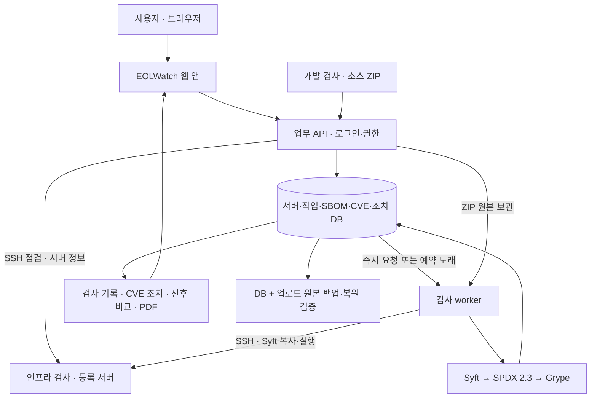

# 교수님 설명용: 전체 구조·웹 앱·시연 시나리오

기준: 2026-09-21 현재 구현 코드. 실제 검사·화면·백업 증거는 과거 [확장 검증 기록](PROJECT_EXPANSION_VERIFICATION.md)과 [조치 전후 검증](archive/REMEDIATION_VERIFICATION_2026-09-15.md)에 있다(당시 메뉴 이름 기준). 아래 시연 순서는 기능을 보여주는 계획이며 실행하지 않은 결과를 성공 기록으로 대신하지 않는다. 발표 자료는 교수님 8단계 순서로 맨 마지막에 만든다.

## 1. 무엇을 만드는가

**"EOLWatch는 개발 소스와 운영 서버의 취약점을 검사하고, 그 결과를 검사 기록으로 관리하는 개발 및 인프라 취약점 검사 솔루션입니다."**

검사 도구인 Syft·Grype로 SBOM과 취약점 근거를 만들고, EOLWatch가 서버 등록·검사 실행·서버 정보 수집·이력·조치·전후 비교·보고서를 제공한다. 사용자는 두 가지 방법으로 검사를 시작하고 결과는 한 곳의 기록에서 다시 본다.

| 축 | 사용자 | 솔루션 | 결과 |
|---|---|---|---|
| 개발 검사 | 소스 ZIP 업로드 | Syft → SPDX 2.3 → Grype | 라이브러리별 CVE·수정 버전·심각도 |
| 인프라 검사 | 서버 IP·SSH 계정 등록 | SSH로 Syft 복사·실행, 설치 패키지·서버 정보 수집 | 서버 정보, OS 패키지 CVE |
| 검사 기록 | 과거 검사 조회 | DB의 검사·결과·조치 이력 | 이력, 전후 비교, PDF·JSON, 조치 기록 |

## 2. 전체 구조는 어떻게 되는가

- 관리 VM 1대에서 웹·API·DB·worker를 실행한다.
- 대상 VM 2대는 실제 수집·검사할 서버다.
- 웹 요청은 먼저 DB 작업으로 저장되므로 사용자가 긴 검사 동안 HTTP 응답을 기다릴 필요가 없다.
- 서버 검사는 SSH로, 소스 ZIP은 관리 worker에서 처리한다. 둘 다 프로그램을 임의 실행하거나 패키지를 설치하지 않는다.
- 이전 검사 원본과 조치 기록을 보존해 "무엇을 보고 조치했는지"를 다시 확인할 수 있다.

세부 구조·저장소는 [ARCHITECTURE.md](ARCHITECTURE.md)에 있다.

## 3. 어떤 애플리케이션인가

사용자가 쓰는 애플리케이션은 **EOLWatch 웹**이고, 취약 라이브러리를 포함한 Python 데모 앱이나 업로드 프로젝트는 **검사 대상**이다.

| 웹 화면 | 사용자가 하는 일 | 보여줄 핵심 |
|---|---|---|
| 개요 | 등록 서버·미조치 CVE·서버별 최근 검사 확인 | 마지막 성공과 최근 실패·진행을 분리 |
| 개발 검사 | 소스 ZIP 업로드, 진행 상태, 결과 보기 | 실제 프로젝트 입력에서 CVE까지 |
| 인프라 검사 | 서버 등록, SSH 점검(서버 정보), 취약점 검사 | 서버 접속 정보만으로 검사 시작 |
| 검사 기록 · 검사 이력 | 서버·범위·날짜로 과거 검사 검색, 비교 선택 | 재현 가능한 이력 |
| 검사 기록 · CVE 결과·조치 | 탐지 결과·수정 버전·KEV/EPSS·AI 선별·조치 관리 | 탐지 후 무엇이 급하고 누가 처리하는가 |
| 검사 기록 · 의존성 목록 | 구성요소·버전·라이선스·의존관계·원본 | 검사 결과의 구성 근거 |
| 검사 기록 · 검사 전후 비교 | 이전·이후 검사 비교, PDF·JSON | 같은 서버·범위의 변화 |
| (API) | 사용자 권한, 감사 로그는 API로 관리 | 변경 추적 |

## 4. 주 시나리오 1: 개발 검사 — 소스 ZIP

**상황:** 개발팀이 프로그램 소스와 패키지 명세가 들어 있는 ZIP을 전달했다.

| 순서 | 보여줄 화면/행동 | 설명할 내용 |
|---|---|---|
| 1 | `개발 검사`에서 서버·프로젝트 이름·ZIP 선택 | 결과를 묶는 기준과 입력 제한(500 MiB, 명세·잠금 파일) |
| 2 | 대기·수집·분석·저장 상태 | worker가 Syft → SPDX → Grype를 실행 |
| 3 | `결과 보기` → CVE 결과 | 공개 취약점, 수정 버전, 심각도. 선언 정보인지 설치 정보인지 함께 설명 |
| 4 | `의존성 목록` | 명세/잠금 파일에서 식별한 버전·라이선스·의존관계 |
| 5 | 변경된 ZIP을 같은 서버·프로젝트 이름으로 재업로드 | 같은 범위의 전후 비교 |

실제로 EOLWatch 자체 소스로 검증했다. 검사 #5의 CVE 9건을 확인한 뒤 업로드 파서·SSH 라이브러리를 업데이트하고 테스트 도구를 운영 의존성에서 분리했다. 같은 프로젝트의 검사 #10에서는 CVE 0건이었다. 비교는 **재검사 미검출 8건·구성요소 제거 1건**으로 구분한다. [실제 전후 PDF](../reports/eolwatch-source-analysis-5-10.pdf)를 함께 보여주면 된다.

시연용 이전 ZIP은 `reports/eolwatch-project-source-before-updates.zip`, 이후 ZIP은 `reports/eolwatch-project-source.zip`이다. 저장된 검사 #5·#10을 조회하면 서버 상태를 다시 바꾸지 않고도 설명할 수 있다. "첨부한 모든 실행 파일을 실행해서 취약점을 시험한다"는 방식이 아니다.

## 5. 주 시나리오 2: 인프라 검사 — 서버 등록과 앱 업데이트

**상황:** 운영 서버에 설치된 라이브러리에서 CVE가 검출됐다. 담당자가 버전을 올리고 서비스가 정상인지 확인한 뒤 조치를 기록한다.

| 순서 | 보여줄 화면/행동 | 설명할 내용 |
|---|---|---|
| 1 | `인프라 검사`에서 LAB-VM-01 등록 정보 | 서버 번호·IP·SSH 포트·계정만 입력한다 |
| 2 | `SSH 점검` | CPU·메모리·디스크 사용률, OS, 설치 패키지와 서버 정보 수집 |
| 3 | 검사 범위 `데모 앱 · Python` → `취약점 검사` | Syft를 서버에 복사해 실행, Jinja2 3.1.4의 CVE·수정 버전 |
| 4 | `검사 기록` → `CVE 결과·조치` → `조치 관리` | 상태·검토 메모를 기록 |
| 5 | 대상 앱 라이브러리 업데이트와 HTTP 확인 | 운영자가 실제 변경과 정상 동작 확인을 수행 |
| 6 | 같은 서버·같은 범위 재검사 | 새 작업·검사 번호와 Jinja2 3.1.6 |
| 7 | `검사 전후 비교` | 버전 변화, 재검사 미검출, 계속 검출·신규 여부 |
| 8 | 조치 관리에서 이후 검사를 근거로 첨부 | 실제 작업 메모와 운영자의 완료 판단·변경 이력 |
| 9 | PDF·JSON 다운로드 | 원본 해시·범위·버전·CVE 근거를 제출 자료로 보존 |

2026-09-15에 검증한 저장 이력은 검사 #3 → #4, SBOM #12 → #13이며 **지정 Python 환경의 CVE 3건 → 0건**이었다. 이 번호·건수는 당시 결과다. 다시 실행하면 새 번호와 현재 DB 결과를 사용한다. 검사 시연만으로 전체 OS의 취약점이 사라졌거나 실제 악용이 차단됐다고 설명하지 않는다. `OS · 설치 패키지` 범위는 Ubuntu 패키지 669개와 그에 연결된 대량 CVE를 보여준다.

재현 명령과 앱 서비스 확인은 [REMEDIATION_DEMO.md](REMEDIATION_DEMO.md)를 따른다. 자동 패치 버튼은 현재 기능이 아니다.

## 6. 시나리오 3: 검사 기록

1. `검사 이력`에서 서버·범위·날짜·상태로 과거 검사를 찾는다. 서버에서 페이지를 나누므로 최근 100건 이전의 결과도 선택할 수 있다.
2. 같은 프로젝트 이름으로 새 버전의 ZIP을 올려 검사 이력이 쌓이는 것을 보여준다.
3. 이전·이후 검사를 선택해 `검사 전후 비교`로 이동하고 PDF·JSON을 내려받는다.
4. `CVE 결과·조치`에서 조치 상태와 메모를 기록한 뒤 새로고침해도 상태·이력이 보존되는지 보여준다.
5. `개요`에서 전체 이력의 미조치 CVE와 현재 기준 미조치 CVE를 구분한다. 과거 기록을 지우지 않고 현재 위험을 계산하는 이유를 설명한다.

## 7. 운영·추가 서비스

- **권한·감사:** 관리자/조회자 계정과 감사 로그는 API(`/api/auth/users`, `/api/auth/audit-logs`)로 보여준다. 조회자로 로그인하면 검사 요청·조치 버튼이 비활성화된다.
- **실패·취소:** 존재하지 않는 경로나 연결 실패가 정상 0건이 아닌 FAILED로 표시되는 것을 보여준다. 원인 해결 후 재시도는 새 이력으로 남는다. 실행 중 취소는 프로세스 종료 확인 후 확정된다.
- **복구:** DB·ZIP 백업 manifest와 임시 DB 복원 결과를 보여준다. 실제 운영 DB를 발표 중 덮어쓸 필요는 없다.

## 8. 예상 질문에 답하기

| 질문 | 답변 |
|---|---|
| SBOM만 있으면 CVE가 나오는가? | SBOM은 구성 목록이다. Grype가 구성요소·버전을 공개 취약점 정보와 대조한다. |
| 서버에 에이전트를 설치해야 하는가? | 상주 프로세스는 없다. 요청 때 SSH로 검증된 Syft 실행 파일 하나를 복사해 실행하고(홈 디렉터리에 남는다), 읽기 전용 명령으로 서버 정보를 수집한다. |
| CVE가 수천 건인데 과탐 아닌가? | 아니다. 소스 패키지+버전 조건 매칭이고 Ubuntu 추적기와 80건 중 78건 일치. 이전 커널 잔존분은 업데이트로 사라지고 나머지는 Ubuntu 미수정분이다. KEV·EPSS로 급한 것을 앞에 세운다(`KERNEL_CVE_VERIFICATION_2026-09-22.md`). |
| AI에 서버 구조가 넘어가지 않나? | 주소·호스트명·계정·인스턴스 번호·비밀번호는 보내지 않고, 보낼 전문을 화면에서 볼 수 있다(`AI.md`). |
| 직접 만든 부분은 무엇인가? | 서버 등록·SSH 서버 정보 수집, ZIP 입력 제한, 작업 큐·예약·취소·재시도, 원본 보존·검색·비교, 조치 업무, 보고서와 운영 검증이다. |
| 0건이면 안전한가? | 해당 입력·도구·DB에서 미검출이라는 뜻이다. 실행 환경과 서비스 정상 여부를 검토한 뒤 담당자가 판단한다. |
| 아무 프로그램이나 첨부 가능한가? | 소스 ZIP, 의존성 파일 하나, https Git 저장소 주소, 등록 서버를 지원하며 포함된 패키지 자료를 읽는다. 컨테이너 이미지는 지원하지 않는다. |
| 클라우드 서버도 검사하는가? | SSH로 접속 가능한 Linux 서버면 된다. EC2 메타데이터·DMI로 클라우드·가상화 여부를 표시하지만 클라우드 계정 API는 연동하지 않는다. |
| 실무 서비스로 바로 공개할 수 있는가? | 현재 검증 범위는 로컬 관리 환경이다. 공개 다중 조직 운영·접근 격리·추가 배포 환경 인증은 별도 범위다. |

## 9. 발표 8단계와 대응 자료

| 단계 | 내용 | 자료 |
|---|---|---|
| 1 개요 | 솔루션 정의, 세 축 | 1절, [SCOPE_V3](SCOPE_V3.md) |
| 2 솔루션 전체 구성도 | 사용자 → 웹 → 검사 → 기록 | 2절 |
| 3 시스템 구성도 | 관리 VM·대상 VM·볼륨·도구 | [ARCHITECTURE](ARCHITECTURE.md) 1절 |
| 4 서비스 구성도 | 메뉴 5개와 검사 기록 탭 | 3절 |
| 5 서비스 설명 | 개발 검사 시나리오 | 4절, 6절 |
| 6 인프라 설명 | 인프라 검사·서버 정보·앱 업데이트 시나리오 | 5절 |
| 7 추가 서비스 | AI 요약·수집 에이전트, 권한·감사, 백업 | 7절 |
| 8 마무리 | 판단 기준·범위 밖·Q&A | 8절 |

[현재 범위](SCOPE_V3.md) · [구현 현황](IMPLEMENTATION_STATUS.md) · [웹 사용 안내](WEB_ANALYSIS.md) · [과거 실행 검증](PROJECT_EXPANSION_VERIFICATION.md)
