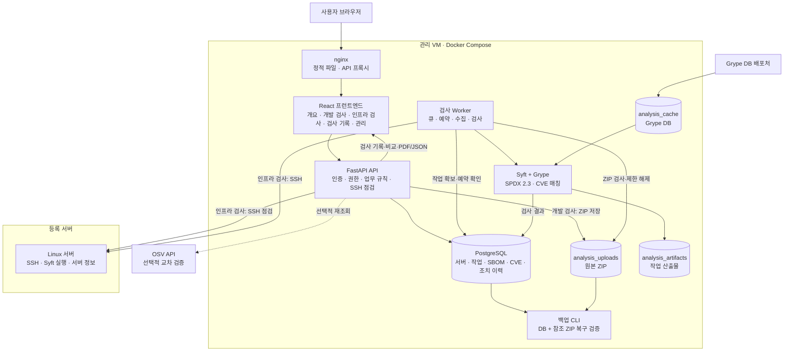
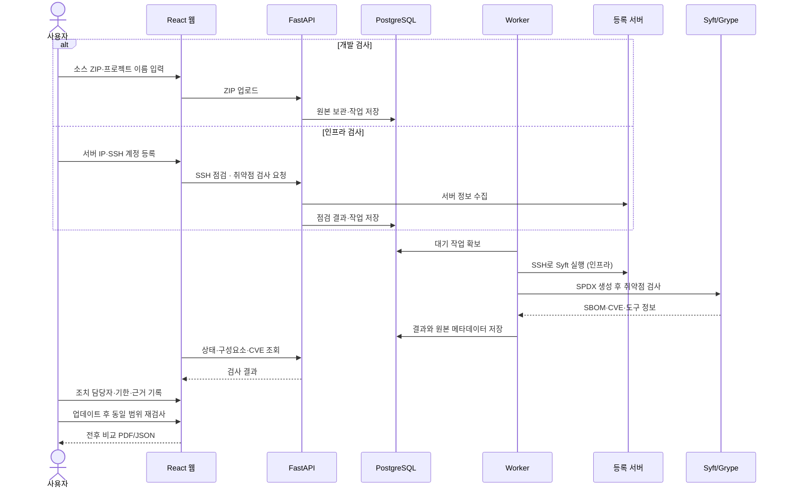

# EOLWatch 프로젝트 구성도와 단계별 진행 계획

코드 기준: 2026-09-21. 이 문서는 현재 구현된 기능을 하나의 구성도로 설명하고, 이후 작업을 [재시작 계획](RESTART_PLAN.md)의 진행 순서에 맞춰 정리한다. 두 문서가 충돌하면 재시작 계획을 따른다.

## 1. 프로젝트 한 줄 정의

EOLWatch는 **소스 ZIP(개발)과 등록 서버(인프라)의 취약점을 검사하고, CVE 결과·조치·전후 비교를 검사 기록으로 관리하는 개발 및 인프라 취약점 검사 솔루션**이다.

운영자가 직접 패키지를 설치하거나 자동으로 수정하는 시스템은 아니다. 검사 결과와 원본을 보존하고, 담당자가 조치를 결정한 뒤 재검사로 결과를 확인하는 것을 목표로 한다.

## 2. 전체 구성도

### 구성요소별 역할

| 구성요소 | 책임 | 주요 결과 |
|---|---|---|
| React 웹 | 개발 검사·인프라 검사·검사 기록·관리 화면 | ZIP 업로드, 서버 등록, 진행 상태, CVE 결과, 비교 보고서 |
| FastAPI API | 인증, 권한, 입력 검증, SSH 점검, 업무 데이터 변경 | 서버·검사·CVE·조치·감사 API |
| PostgreSQL | 업무 데이터와 검사 이력의 기준 저장소 | 서버, SBOM, 구성요소, CVE, 조치 이력, 점검 결과 |
| Worker | 비동기 검사와 예약 작업 실행 | 수집, 검사, 실패·재시도·취소, 예약 실행 |
| Syft | 입력에서 구성요소와 의존관계 식별 | SPDX 2.3 SBOM |
| Grype | SBOM과 취약점 DB 대조 | CVE 탐지, 심각도, 수정 버전 후보 |
| 등록 서버 | 설치 패키지와 서버 정보 제공 | OS 패키지, Python 패키지, 하드웨어·OS·가상화·클라우드·통신 정보 |
| 원본·산출물 볼륨 | 재현과 감사에 필요한 파일 보존 | 업로드 ZIP, 실행 manifest, 검사 원본 |

## 3. 기능 구성

### A. 개발 검사

- 소스 ZIP 업로드와 서버·프로젝트 이름 연결
- 크기·경로·링크·압축률 검사, 원본 SHA-256 보관
- worker의 정적 구성요소 분석 → SPDX 2.3 → Grype
- 진행 상태, 실패·재시도·취소, 결과 자동 선택
- 저장된 ZIP 다운로드·재검사

### B. 인프라 검사

- 서버 등록·수정·삭제 (번호·이름·유형·IP·SSH 포트·SSH 계정·검사 대상 여부)
- SSH 점검: CPU·메모리·디스크 사용률, 가동 시간, 프로세스, 설치 패키지, OS
- 서버 정보 수집: 호스트·커널·CPU 모델·메모리 총량·디스크 총량·가상화·DMI·EC2 메타데이터·IP·수신 포트·실행 서비스 (`raw_metrics.server_info`)
- Syft 복사·실행으로 OS 설치 패키지·데모 Python 환경 취약점 검사
- 서버 프로젝트 폴더·Python 가상환경 경로 검사 (API)
- 서버 타임라인 (검사·점검·SBOM·조치)

### C. 검사 기록

- 서버·범위별 프로젝트 목록, 검사 결과·작업 이력의 검색·페이지 조회
- 이전·이후 검사 선택과 전후 비교, PDF·JSON 보고서
- 의존성 목록: 구성요소 검색·페이지, 라이선스·해시·PURL, 의존관계, 원본 다운로드
- 최신 성공 검사와 누적 미조치 CVE의 구분

### D. 취약점과 조치

- Grype 기반 CVE 탐지와 원본 결과 보존
- OSV 교차 검증 및 출처·수정 버전 검증
- 서버·SBOM·CVE별 조치 작업목록
- 담당자, 기한, 상태, 메모, 재검사 근거 관리
- 동시 수정 충돌 방지와 추가형 변경 이력
- 미검출만으로 조치 완료를 자동 판정하지 않음

### E. 운영과 추가 서비스

- 관리자·조회자 권한 분리와 감사 로그
- 정기 검사 예약 (API, 추가 서비스)
- DB 스냅샷과 참조 ZIP 백업, 임시 DB 복원 검증
- 개발 Docker Compose 구성

## 4. 사용자 업무 흐름

## 5. 단계별 진행 계획

재시작 계획의 진행 순서를 기준으로 한다.

| 단계 | 목표 | 작업 내용 | 상태 |
|---|---|---|---|
| 0 체크포인트 | 재배치 전 커밋 | 작업 트리 커밋 | 완료 (`5a52a28`) |
| 1 메뉴 재구성 | 4개 축으로 화면 정리 | 메뉴 5개(개요·개발 검사·인프라 검사·검사 기록·관리), 제거 기능 코드·DB 삭제, 테스트 정리 | 완료 (`73c10b5`, `d2f8c4a71e9b`) |
| 2 인프라 검사 보강 | 서버 정보 수집 | collector 명령 추가·파서·테스트, 서버 목록 `서버 정보` 열과 수집 이력 카드 | 완료 (`d0592ac`), 실제 서버 검증 남음 |
| 3 시연 검증 | 두 축을 끝까지 브라우저로 확인 | 개발: ZIP → 결과 → 기록. 인프라: 서버 등록 → 점검·검사 → 서버 정보 → 결과 → 기록. ZIP 재검사·취소·과거 비교 포함 | 남음 |
| 4 문서 정리 | 새 프레임으로 문서 갱신 | 구현 현황·API·구조·데이터 모델·시나리오 | 완료 (2026-09-21) |
| 5 추가 서비스 | 시간이 남을 때만 | 정기 검사 예약(구현됨, 인프라 검사 화면), 결과 요약·조치 가이드 AI 생성, PWA | 선택 |
| 6 발표 자료 | 맨 마지막 | 교수님 8단계 순서 | 남음 |

## 6. 현재 기준 다음 진행 순서

1. 개발·인프라 두 흐름을 브라우저에서 끝까지 시연 검증한다. 인프라 흐름에서는 실제 서버의 서버 정보 카드까지 확인한다.
2. 발표 자료를 교수님 8단계 순서로 작성한다.

## 7. 발표에서 명확히 말할 범위

- `CVE 3건 → 0건`은 데모 Python 가상환경, `9건 → 0건`은 EOLWatch 소스 ZIP 범위의 전후 검사 결과다.
- EOLWatch는 자동 패치 도구가 아니라 검사·근거·조치 이력 관리 시스템이다.
- 소스 ZIP 검사는 설치·빌드·프로그램 실행 없이 메타데이터를 읽는다.
- 서버 정보(하드웨어·가상화·클라우드·통신)는 설명용이며 취약점 판정에 쓰지 않는다. 클라우드 계정 API는 연동하지 않는다.
- Black Duck, 컨테이너 이미지, 공개 다중 조직 SaaS는 현재 범위가 아니다. Git 저장소 검사는 2026-09-21에 추가했다.
- EOL 일정·자산 재고·계약 관리는 2026-09-18에 제거했으며 현재 기능으로 설명하지 않는다.
- 백업 복구는 DB와 참조 ZIP 검증 범위이며 SSH 키·`.env`·서버 이미지까지 포함하지 않는다.

## 8. 관련 문서

- [재시작 계획](RESTART_PLAN.md)
- [현재 구현 현황](IMPLEMENTATION_STATUS.md)
- [시스템 아키텍처](ARCHITECTURE.md)
- [현재 범위](SCOPE_V3.md)
- [웹 검사 실행](WEB_ANALYSIS.md)
- [교수님용 시연 안내](PROFESSOR_PROJECT_GUIDE.md)
- [운영 백업](BACKUP_OPERATIONS.md)
