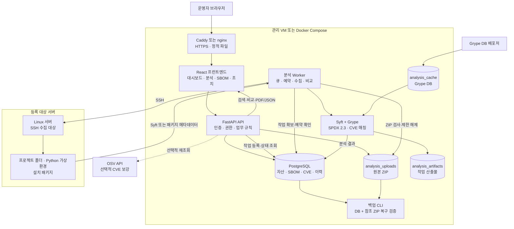
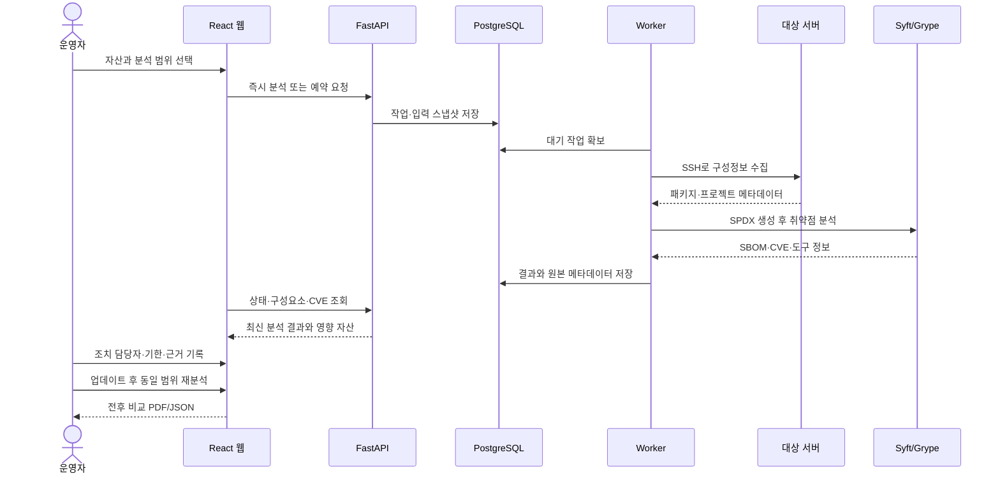

# EOLWatch 프로젝트 구성도와 단계별 진행 계획

코드 기준: 2026-09-16. 이 문서는 현재 구현된 기능을 하나의 구성도로 설명하고, 이후 작업을 기능 단위와 검증 기준으로 나눈 진행 기준이다.

## 1. 프로젝트 한 줄 정의

EOLWatch는 서버와 소스 프로젝트의 소프트웨어 구성을 수집해 **재고자산 정보·SBOM·취약점·지원 종료·조치 이력·자산 영향 범위**를 한곳에서 관리하는 인프라 유지관리 웹 서비스다.

운영자가 직접 패키지를 설치하거나 자동으로 수정하는 시스템은 아니다. 분석 결과와 공식 근거를 보존하고, 담당자가 조치를 결정한 뒤 재분석으로 결과를 확인하는 것을 목표로 한다.

## 2. 전체 구성도



### 구성요소별 역할

| 구성요소 | 책임 | 주요 결과 |
|---|---|---|
| React 웹 | 운영자의 조회·등록·분석·조치 화면 제공 | 대시보드, SBOM 탐색, 작업목록, 비교 보고서 |
| FastAPI API | 인증, 권한, 입력 검증, 업무 데이터 변경 | 자산·분석·CVE·EOL·계약 API |
| PostgreSQL | 업무 데이터와 분석 이력의 기준 저장소 | 자산, SBOM, 구성요소, CVE, 조치 이력 |
| Worker | 비동기 분석과 예약 작업 실행 | 수집, 분석, 실패·재시도, 예약 실행 |
| Syft | 입력에서 구성요소와 의존관계 식별 | SPDX 2.3 SBOM |
| Grype | SBOM과 취약점 DB 대조 | CVE 탐지, 심각도, 수정 버전 후보 |
| 대상 서버 | 등록된 범위의 실제 구성정보 제공 | OS 패키지, Python 패키지, 프로젝트 정보 |
| 원본·산출물 볼륨 | 재현과 감사에 필요한 파일 보존 | 업로드 ZIP, 실행 manifest, 분석 원본 |

## 3. 기능 구성

### A. 자산과 수명주기 관리

- 고객·사이트·서버 자산 등록 및 수정
- 자산명·자산번호·모델명·시리얼번호·제조사·IP 주소 관리
- 구매일·구매가격·보증기간·자산상태·담당자·서비스 중요도 관리
- 건물·층·전산실·랙 번호·랙 위치까지 분리한 설치 위치 관리
- 정격/평균 전력 사용량, 데이터 출처, 유지보수·교체 비용 관리
- 자산명·자산번호·모델·시리얼·IP·위치·담당자·상태 통합 검색과 필터
- 제품·릴리스·지원 종료일·공식 출처 관리
- 제품과 배포 자산 연결
- 유지보수 계약과 영향 자산 관리
- 개별 구성요소 일정 우선 적용 및 제품 일정 상속

### B. 자산 편의성과 의사결정

- 자산 목록에서 위치·운영 상태·EOL·계약·CVE·종합 위험도를 한 번에 표시
- 자산 상세 화면에 기본정보·설치 소프트웨어·SBOM·CVE·EOL/계약·점검 이력·변경 이력 탭 제공
- 분석 완료, 업데이트, 조치 기록, 점검, 계약 변경을 자산 타임라인으로 통합
- CVE·지원 종료·서비스 중요도·계약·점검 상태를 합산한 내부 우선순위 점수 제공
- 위험 점수의 구성 요소와 산정 시점을 함께 보여주고 운영자가 최종 조치 여부를 판단
- 교체·조치 우선순위 목록과 EOL·계약·조치 기한 임박 알림 제공
- 자산 상세 주소를 QR 코드로 연결하고 현장 조회용 요약 정보 제공
- CSV 자산 일괄 등록·수정, 자산과 서비스·서버 간 관계도, 전력·운영비 집계 지원

### C. 분석과 SBOM

- 소스 ZIP 정적 분석
- SSH 서버의 프로젝트 폴더 분석
- Python 가상환경과 Ubuntu 설치 패키지 분석
- 분석 작업의 대기·수집·분석·저장 상태 관리
- 예약 분석, 취소, 실패 후 재시도, 중단 복구
- SPDX 2.3 원본, 구성요소, 라이선스, PURL, 의존관계 탐색
- 원본 ZIP 해시와 작업 산출물 보존

### D. 취약점과 조치

- Grype 기반 CVE 탐지와 원본 결과 보존
- OSV 선택적 재조회 및 출처·수정 버전 검증
- 자산·SBOM·CVE별 조치 작업목록
- 담당자, 기한, 상태, 메모, 재분석 근거 관리
- 동시 수정 충돌 방지와 추가형 변경 이력
- 미검출만으로 조치 완료를 자동 판정하지 않음

### E. 비교와 보고

- 동일 자산·동일 분석 범위의 전후 비교
- 계속 검출·신규 검출·재분석 미검출·구성요소 제거 구분
- PDF·JSON 보고서 다운로드
- 프로젝트별 전체 분석 이력과 저장 ZIP 재분석
- 최신 성공 분석과 과거 조치 이력을 분리 표시

### F. 운영과 복구

- 관리자·조회자 권한 분리
- 감사 로그와 서버 상태 점검
- DB 스냅샷과 참조 ZIP 백업
- 임시 DB 복원, 행·내용·ZIP 해시 검증
- 개발 Docker Compose와 운영 Caddy 구성

## 4. 사용자 업무 흐름



## 5. 자산 상세 화면 구성

자산 상세 화면은 SBOM 분석 결과를 재고자산 업무와 연결하는 대표 화면으로 설계한다.

```text
A 서버 · SRV-001                         [운영 중] [CRITICAL]
위치: 본관 3층 · 서버실 1 · B-12 랙       담당자: 홍길동
모델: Dell PowerEdge R750                시리얼: XXXXX

구매가격: 12,000,000원  전력: 450W        지원 종료: 45일 후
계약 만료: 20일 후      마지막 분석: 2026-09-16

총합 위험도: 82점 · CRITICAL
Critical 2 · High 8 · Medium 21 · 총 CVE 31

[기본 정보] [소프트웨어] [SBOM] [CVE] [EOL·계약] [타임라인]
```

종합 위험도는 EOLWatch 내부의 **업무 우선순위 점수**로 표시한다. 예시 가중치는 CVE 심각도 40%, 지원 종료 25%, 서비스 중요도 20%, 계약 상태 10%, 최근 점검 상태 5%이며, 산정 근거·최종 계산 시각·누락된 입력을 함께 표시한다. 점수가 실제 공격 가능성이나 자동 조치 완료를 의미하지 않는다는 점을 화면과 문서에 명시한다.

## 6. 단계별 진행 계획

현재 프로젝트는 1~5단계 핵심 기능이 구현된 상태다. 이후에는 새 기능을 무작정 추가하기보다 각 단계의 검증과 발표 완성도를 높이는 순서로 진행한다.

| 단계 | 목표 | 작업 내용 | 완료 기준 |
|---|---|---|---|
| 1단계 기반 | 서비스 실행 기반 확립 | Docker, PostgreSQL, 인증, 자산·사이트·제품 모델 | 로그인 후 자산을 등록·조회하고 DB에 보존 |
| 2단계 자산 원장 | 재고자산 식별·검색 기반 확립 | 자산명·자산번호·모델·시리얼·위치·구매·전력·계약 필드와 검색·필터 | 자산을 조건으로 찾고 상세정보를 저장·조회 |
| 3단계 분석 | 실제 구성정보 수집 | ZIP·SSH 입력, Syft, SPDX 저장, 작업 상태·실패 처리 | 동일 입력을 재분석해 이력과 원본을 확인 |
| 4단계 위험 | CVE·EOL과 자산 위험 연결 | Grype, OSV 보강, 지원 종료, 자산별 종합 위험도·우선순위 | 자산에서 CVE·EOL·위험 산정 근거를 추적 |
| 5단계 조치 | 운영자의 remediation 흐름 완성 | 작업목록, 담당자·기한·상태·근거, 동시 수정 보호, 타임라인 | 업데이트 전후 변화와 자산 변경 이력을 확인 |
| 6단계 운영 | 반복 실행과 증거 보존 | 예약·취소·재시도, 비교 보고서, 백업·복구, 권한 | 실패·복구·백업 검증과 PDF/JSON 출력 성공 |
| 7단계 편의성 | 현장·관리 업무 단순화 | 만료 알림, QR, CSV 일괄 등록, 관계도, 전력·비용·교체 우선순위 | 자산 목록에서 처리 우선순위와 관련 업무를 확인 |
| 8단계 마무리 | 발표·운영 품질 강화 | UI 문구 정리, 시연 데이터 고정, 보안 설정, 문서화 | 교수님 시연을 정해진 순서로 재현하고 범위를 설명 |

## 7. 현재 기준 다음 진행 순서

1. 자산 원장에 자산명·모델명·시리얼번호·위치·구매·전력·담당자 필드를 정리한다.
2. 자산 목록 검색·필터와 자산 상세 요약 화면을 먼저 구현한다.
3. `프로젝트 분석`에서 ZIP 또는 대상 서버 분석을 실행하고 결과를 자산에 연결한다.
4. 자산별 SBOM·CVE·EOL 요약과 종합 위험도 계산 근거를 표시한다.
5. 분석·조치·점검·계약 변경을 하나의 자산 타임라인으로 묶는다.
6. `조치 작업목록`과 자산 우선순위 화면에서 담당자·기한·근거를 기록한다.
7. 대상 라이브러리를 업데이트하고 같은 자산·범위로 재분석해 전후 비교한다.
8. QR·만료 알림·일괄 등록·관계도·비용 기능을 우선순위에 따라 확장한다.
9. PDF·JSON 보고서와 백업 복구 검증 결과를 제출 자료에 연결한다.

## 8. 발표에서 명확히 말할 범위

- `CVE 3건 → 0건`은 지정한 데모 Python 가상환경의 전후 분석 결과다.
- EOLWatch는 자동 패치 도구가 아니라 분석·근거·조치 이력 관리 시스템이다.
- 소스 ZIP 분석은 설치·빌드·프로그램 실행 없이 메타데이터를 읽는다.
- Black Duck, Git URL, 컨테이너 이미지, 공개 다중 조직 SaaS는 현재 필수 범위가 아니다.
- 종합 위험도는 운영자가 처리 순서를 정하기 위한 내부 점수이며 CVSS나 실제 공격 가능성의 대체값이 아니다.
- 백업 복구는 DB와 참조 ZIP 검증 범위이며 SSH 키·`.env`·서버 이미지까지 포함하지 않는다.

## 9. 관련 문서

- [현재 구현 현황](IMPLEMENTATION_STATUS.md)
- [시스템 아키텍처](ARCHITECTURE.md)
- [현재 범위](SCOPE_V3.md)
- [웹 분석 실행](WEB_ANALYSIS.md)
- [교수님용 시연 안내](PROFESSOR_PROJECT_GUIDE.md)
- [운영 백업](BACKUP_OPERATIONS.md)