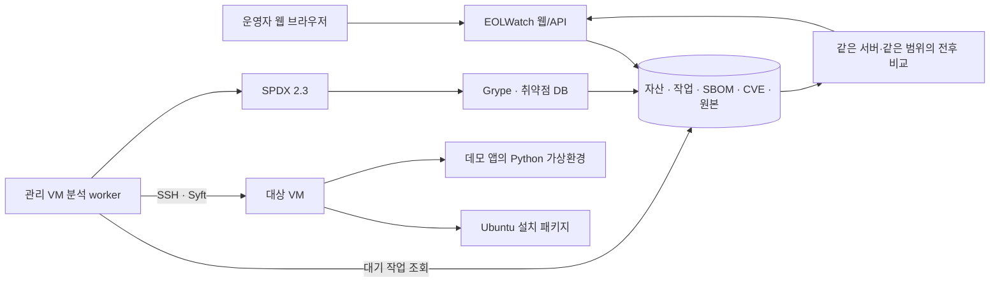

# EOLWatch: 데모 앱 업데이트 전후 비교

## 교수님께 설명할 구조

EOLWatch는 운영자가 브라우저에서 서버와 구성요소의 위험을 확인하고 조치 근거를 비교하는 웹 애플리케이션이다. Syft가 설치 구성요소를 수집해 SBOM을 만들고 Grype가 CVE를 연결한다. EOLWatch는 자산 연결, 분석 실행, 이력 보관, 전후 비교와 운영자의 조치 상태 기록을 담당한다. Black Duck 계정은 필요하지 않다.



운영자는 `작업 대상`에서 분석 범위를 선택한다.

| 선택 | 실제 수집 범위 | 수집기 |
|---|---|---|
| Ubuntu 설치 패키지 | 해당 서버의 dpkg 설치 패키지 | `dpkg-db-cataloger` |
| 데모 앱 · Python | SSH 사용자의 `~/eolwatch-demo/.venv`에 설치된 Python 패키지 | `python-installed-package-cataloger` |

데모 프로필은 고정 경로만 사용한다. 요청에서 임의의 경로나 SSH 명령을 받지 않는다. 라이브러리 선언 파일에 적힌 버전이 아니라 설치된 패키지 메타데이터를 수집한다. OS와 앱의 결과는 별도 분석 이력으로 보관한다.

## 보여줄 애플리케이션

- **관리 앱:** EOLWatch 웹의 자산 목록, 분석 작업, CVE 결과, 전후 비교 화면.
- **분석 대상 앱:** Jinja2로 서버 안내 HTML을 출력하는 작은 Python 웹 앱. 설치된 Jinja2 버전을 페이지와 `/health`에 표시한다.
- 분석 대상 앱은 대상 VM의 `127.0.0.1:19090`에서 실행한다. 확인하려면 SSH 터널을 연다. 외부 입력은 고정 템플릿의 문자열 데이터로만 사용하며, 사용자 템플릿 실행 기능은 없다.
- 이 시연은 취약 버전의 발견과 업데이트 후 탐지 변화 확인이다. 실제 공격 성공을 입증하는 시연은 아니다. Jinja 샌드박스 CVE의 실제 악용 조건에는 공격자가 템플릿을 제어하는 등의 조건이 추가로 필요하다.

## 재현 순서

프로젝트 루트에서 실행한다. 대상은 기존 로컬 실습 VM `LAB-VM-01` 또는 `LAB-VM-02`로 제한된다. 설치 스크립트는 관리 VM의 기존 검증된 SSH 호스트 키를 재사용한다.

1. 데모 앱의 이전 버전을 배치한다.

   ```bash
   python3 scripts/manage-demo-app.py LAB-VM-01 baseline
   ```

   Jinja2 **3.1.4**, MarkupSafe **3.0.3**을 전용 가상환경에 설치하고 앱을 시작한다. 도구용 pip **25.2** wheel은 가상환경 바깥에 둔다. 각 wheel은 공식 PyPI 메타데이터의 SHA-256과 비교한 뒤 대상에서도 다시 검증한다.

2. `http://127.0.0.1:18080`에서 로그인 → `작업 대상` → `LAB-VM-01` → `데모 앱 · Python` → `취약점 분석`을 누른다.
3. 완료된 분석의 CVE 결과에서 구성요소 이름, 설치 버전, 수정 버전과 출처를 보여준다. 분석 이력 번호를 기록한다.
4. 실제 대상 라이브러리를 업데이트한다.

   ```bash
   python3 scripts/manage-demo-app.py LAB-VM-01 fixed
   ```

   같은 가상환경의 Jinja2를 **3.1.6**으로 교체하고 해당 데모 앱을 다시 시작한다. 렌더링과 HTTP 상태를 함께 확인한다. EOLWatch 웹이 운영 서버를 자동 패치하는 기능은 아직 없다.

5. 같은 서버, 같은 `데모 앱 · Python` 범위에서 웹 분석을 다시 실행한다.
6. `CVE 조치`의 전후 비교에서 3번의 이전 분석과 5번의 새 분석을 선택한다. 버전 변화, 계속 검출, 새로 검출, 재분석 미검출, 구성요소 제거를 확인한다.
7. 분석 이력의 원본 다운로드로 각 시점의 SPDX와 Grype 보고서를 제시한다. 과거 CVE 기록과 운영자가 입력한 조치 상태는 유지된다.
8. 비교 결과에서 `검증 보고서 PDF` 또는 `검증 데이터 JSON`을 내려받아 분석 범위·도구·버전 변화와 원본 해시를 제시한다. [보고서 사용 안내](COMPARISON_REPORTS.md)를 참고한다.

설치 스크립트는 `~/eolwatch-demo`만 관리하고 OS 패키지는 변경하지 않는다. 실습 프로세스는 VM 재시작 후 자동 시작하지 않으므로 재부팅했다면 필요한 상태의 설치 명령을 다시 실행한다. `.venv`는 남아 있어 앱을 실행하지 않은 상태에서도 설치 구성요소 분석은 가능하다.

대상 앱 페이지도 브라우저에 보여주려면 설치 후 별도 터미널에서 다음 터널을 유지하고 `http://127.0.0.1:19091`을 연다. 종료는 해당 터미널에서 Ctrl+C다.

```bash
ssh -i infrastructure/local-vm/runtime/id_ed25519 -p 12223 \
  -o StrictHostKeyChecking=yes \
  -o UserKnownHostsFile=infrastructure/local-vm/runtime/demo-app/LAB-VM-01/known_hosts \
  -N -L 127.0.0.1:19091:127.0.0.1:19090 eolwatch@127.0.0.1
```

## 비교 결과를 읽는 기준

| 표시 | 의미 |
|---|---|
| 계속 검출 | 같은 구성요소의 같은 CVE가 두 분석 모두에 있음 |
| 새로 검출 | 이후 분석에서 새롭게 탐지됨 |
| 재분석 미검출 | 구성요소가 이후 SBOM에도 있으나 이전 CVE는 보고되지 않음 |
| 구성요소 제거 | 이전 CVE에 연결된 구성요소가 이후 SBOM에 없음 |

서로 다른 자산·범위 또는 거꾸로 된 시간 순서는 비교를 거부한다. 패키지 생태계·네임스페이스·아키텍처 등 식별 정보와 여러 설치 버전을 보존해 비교한다. 원본이 잘못됐거나 보고서의 구성요소가 SBOM과 맞지 않으면 정상 0건으로 처리하지 않는다.

성공한 웹 분석과 연결되지 않은 수동 반입, 분석 도구 또는 취약점 DB 변경 등은 비교 주의사항으로 표시한다. **미검출만으로 VEX를 자동 `FIXED`로 바꾸지 않는다.** 구성요소 버전, 수정 권고, 실행 경로와 기능 정상 여부를 함께 확인한 뒤 운영자가 판단한다.

## 공식 수정 근거

- [Jinja 3.1.5 릴리스](https://github.com/pallets/jinja/releases/tag/3.1.5): CVE-2024-56326에 연결된 간접 `str.format` 처리 수정 등.
- [Jinja 3.1.6 릴리스](https://github.com/pallets/jinja/releases/tag/3.1.6): `attr` 필터를 통한 샌드박스 우회 수정.
- [CVE-2024-56326의 영향 조건](https://github.com/pallets/jinja/security/advisories/GHSA-q2x7-8rv6-6q7h).
- [attr 필터 문제의 영향 조건](https://github.com/pallets/jinja/security/advisories/GHSA-cpwx-vrp4-4pq7).

고정한 버전과 실제 분석일의 DB를 기준으로 결과를 기록한다. 미래의 CVE 정보가 추가되면 결과 건수는 달라질 수 있다.
