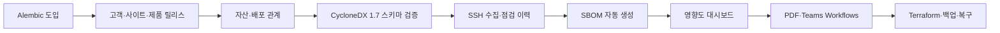

# EOLWatch 기술 스택 선정

## 1. 최종 선정안

### 애플리케이션

| 영역 | 기술 | 상태 | 선정 이유 |
|---|---|---|---|
| 백엔드 언어 | Python 3.12 | 사용 | SSH 수집, 데이터 처리, PDF 생성까지 한 언어로 구현 가능 |
| API | FastAPI 0.116 | 사용 | 타입 기반 검증과 OpenAPI 문서 자동 생성, 비동기 외부 API 연동 |
| 데이터 검증 | Pydantic 2 | 사용 | 자산 입력과 CycloneDX 문서 경계 검증 |
| ORM | SQLAlchemy 2 | 사용 | PostgreSQL 관계와 트랜잭션을 명시적으로 관리 |
| DB 마이그레이션 | Alembic 1.16 | 사용 | ERD 변경을 SQL 이력으로 남기고 운영 DB를 안전하게 변경 |
| 프런트엔드 | React 19 | 사용 | 자산·위험도·SBOM 관계를 컴포넌트 단위로 표현 |
| 빌드 도구 | Vite 8 | 사용 | 빠른 개발 서버와 작은 설정 범위 |
| 차트 | Recharts | 도입 예정 | 위험도 분포와 점검 추이를 React 안에서 구현 |
| 데이터베이스 | PostgreSQL 16 | 사용 | 관계형 무결성, JSONB 원문 보존, 날짜·집계 질의 지원 |

### 인프라 수집과 SBOM

| 영역 | 기술 | 상태 | 선정 이유 |
|---|---|---|---|
| SBOM 표준 | CycloneDX JSON 1.7 | 사용 | 소프트웨어·하드웨어·서비스와 의존관계를 같은 BOM 모델로 확장 가능 |
| 호환 가져오기 | CycloneDX JSON 1.4~1.7 | 사용 | 기존 생성 도구가 만든 문서를 수용 |
| SBOM 생성 | cyclonedx-python-lib | 도입 예정 | SSH에서 얻은 패키지 목록을 CycloneDX 객체로 안전하게 직렬화 |
| 원격 수집 | Paramiko SSH | 사용 | 고객 대상 서버에 EOLWatch 전용 에이전트를 설치하지 않고 조회 명령 실행 |
| AWS 대상 수집 | AWS Systems Manager Run Command | 선택 | 공개 SSH와 개인키 관리 없이 EC2 명령 실행 |
| 스케줄 | APScheduler | 사용 | 단일 서비스 EC2에서 일일 작업을 실행하기에 충분하며 Redis가 필요 없음 |
| 취약점 | OSV API | 선택 | purl 기반 오픈소스 취약점 조회, MVP 이후 추가 |
| 영향 상태 | CycloneDX VEX | 선택 | 탐지된 취약점이 실제 환경에 영향을 주는지 상태 기록 |

### 배포와 운영

| 영역 | 기술 | 상태 | 선정 이유 |
|---|---|---|---|
| 컨테이너 | Docker Compose | 사용 | API·웹·DB·수집기를 한 서버에서 재현 가능하게 구성 |
| 리버스 프록시 | Caddy 2 | 구성 완료 | HTTPS 인증서 발급·갱신과 HTTP→HTTPS 전환 자동화 |
| 클라우드 | AWS EC2 | 배포 예정 | 외부 시연 환경과 점검 대상 EC2를 같은 계정에서 구성 |
| IaC | Terraform | 구성·검증 완료 | VPC·보안그룹·EC2·S3 구성을 코드로 재생성 |
| 비밀정보 | SSM Parameter Store | 배포 시 추가 | SSH 키, DB 비밀번호, Teams URL을 코드와 분리 |
| 백업 | pg_dump + S3 | 스크립트 완료 | PostgreSQL 논리 백업과 인스턴스 외부 보관 |
| 로그 | Python logging + Docker logs + CloudWatch | 배포 시 추가 | 앱·수집 실패 로그를 분리하고 외부에서 확인 |
| PDF | WeasyPrint | 도입 예정 | HTML/CSS 양식을 일일 점검·교체 계획 PDF로 재사용 |
| 알림 | Microsoft Teams Workflows Webhook | 도입 예정 | Adaptive Card로 EOL과 점검 실패 알림 전송 |
| CI/CD | GitHub Actions | CI 구성 완료 | 테스트와 빌드가 성공한 커밋만 EC2에 배포 |

### 품질과 보안

| 영역 | 기술 | 적용 내용 |
|---|---|---|
| 백엔드 테스트 | pytest + FastAPI TestClient | 위험도 경계값, 자산·SBOM API, DB 관계 검증 |
| 프런트 테스트 | Vitest | 주요 계산·화면 상태 테스트 |
| E2E | Playwright | 로그인→자산 등록→SBOM 업로드→대시보드 흐름 1개 |
| 코드 품질 | Ruff | Python 포맷·린트·import 정리 |
| 인증 | JWT + Argon2 | 짧은 access token, 관리자·조회자 RBAC |
| SBOM 검증 | CycloneDX JSON Schema | 지원 버전과 구조 검증, 파일 크기 제한 |
| 감사 | 애플리케이션 audit log | 로그인과 자산·EOL·SBOM 변경 전후 기록 |

## 2. 선택 이유

### FastAPI + SQLAlchemy

수집기와 API가 모두 Python이므로 언어를 나누지 않는다. FastAPI는 요청 스키마와 API 문서를 같이 관리할 수 있고, SQLAlchemy는 고객·사이트·자산·제품·SBOM의 여러 관계를 명시적으로 표현한다. 현재 구현처럼 시작 시 `create_all()`을 호출하는 방식은 개발 초기까지만 사용하고, 목표 ERD로 전환하기 전에 Alembic 마이그레이션으로 바꾼다.

### PostgreSQL

핵심 데이터는 관계형이다. 고객→사이트→자산, 자산→설치 제품, SBOM→구성요소→의존관계에 FK와 유일성 제약이 필요하다. 동시에 CycloneDX 원본, 가변적인 디스크·프로세스 결과는 JSONB가 적합하다. MongoDB를 함께 두지 않고 PostgreSQL 한 개로 처리해 운영 부담을 줄인다.

### React

대시보드는 자산 표, 위험도 카드, SBOM 품질, 구성요소 영향 관계를 반복해서 갱신해야 한다. React로 화면 상태를 관리하고 Recharts로 위험도와 점검 추이를 표시한다. Next.js의 서버 렌더링은 내부 업무용 대시보드에 필요하지 않아 사용하지 않는다.

### APScheduler

최종 배포는 서비스 인스턴스 한 대이므로 분산 작업 큐가 필요하지 않다. APScheduler가 매일 점검, EOL 재계산, 백업, 리포트를 실행한다. 향후 수집 대상이 수백 대로 늘고 워커 수평 확장이 필요할 때 Celery·Redis 또는 AWS EventBridge/SQS로 교체한다.

### SSH와 Systems Manager

일반 고객사·실습 서버는 Paramiko로 읽기 전용 SSH 수집을 수행한다. AWS 시연용 EC2는 Systems Manager Run Command를 선택할 수 있다. AWS는 Systems Manager를 사용하면 공개 SSH/RDP와 직접 자격증명 관리를 줄일 수 있다고 안내한다.

### Teams Workflows

기존 Microsoft 365 Connector 방식의 Incoming Webhook은 폐기 단계이므로 새 구현에 사용하지 않는다. Teams Workflows의 `When a Teams webhook request is received` 트리거로 HTTP 요청을 받고 Adaptive Card를 채널에 게시한다. Workflow 소유자가 퇴사하거나 계정이 비활성화되면 중단될 수 있어 공동 소유자를 지정한다.

## 3. 사용하지 않는 기술

| 기술 | 제외 이유 |
|---|---|
| Kubernetes | 단일 EC2와 1인 프로젝트에 운영 복잡도가 지나치게 큼 |
| Prometheus + Grafana | EOL·계약·SBOM이 핵심이며 초 단위 모니터링은 범위 밖 |
| Elasticsearch | 자산 500건, 점검 대상 20대 목표에서는 PostgreSQL 검색으로 충분 |
| MongoDB | 관계 무결성이 중요한 구조이며 DB를 두 종류 운영할 이유가 없음 |
| Celery + Redis | 단일 스케줄러로 처리 가능한 규모이며 장애 지점이 늘어남 |
| 상시 설치형 자체 에이전트 | 고객 서버 설치·업데이트·권한 승인 부담이 생김 |
| SPDX 동시 지원 | 6주 안에 두 표준의 파서와 검증을 모두 안정화하기 어려움 |

## 4. 버전 및 재현 정책

- Python 패키지는 `requirements.txt`에 정확한 버전을 고정한다.
- Node 패키지는 `package-lock.json`을 배포 기준으로 사용한다.
- Docker 이미지는 발표 버전 확정 시 major 태그 대신 patch 또는 digest로 고정한다.
- CycloneDX 신규 생성 문서는 1.7 JSON을 기준으로 한다.
- CycloneDX 2.0은 안정 버전과 사용 도구 지원이 확인된 뒤 검토한다.
- 매주 Dependabot 또는 수동 점검으로 의존성 변경을 확인하되 발표 직전 대규모 업그레이드는 피한다.

## 5. 구현 순서

취약점 자동 연동은 핵심 인프라 수명주기 흐름이 완성된 뒤 추가한다. 시간이 부족하면 OSV·VEX를 제외해도 자산→인프라 소프트웨어→SBOM→EOL 영향도라는 프로젝트 핵심은 유지된다.

## 6. 참고 문서

- [CycloneDX Specification](https://cyclonedx.org/specification/overview/)
- [AWS Systems Manager Run Command](https://docs.aws.amazon.com/systems-manager/latest/userguide/run-command.html)
- [AWS: SSH 대신 Systems Manager 사용](https://docs.aws.amazon.com/prescriptive-guidance/latest/aws-startup-security-baseline/wkld-06.html)
- [Microsoft Teams Workflows Webhook](https://learn.microsoft.com/microsoftteams/platform/webhooks-and-connectors/how-to/add-incoming-webhook)
